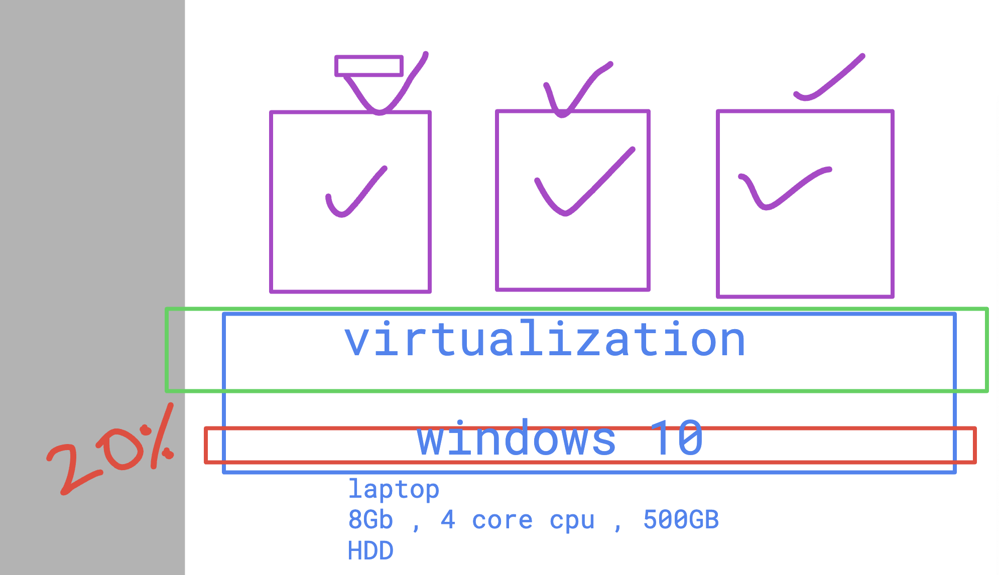
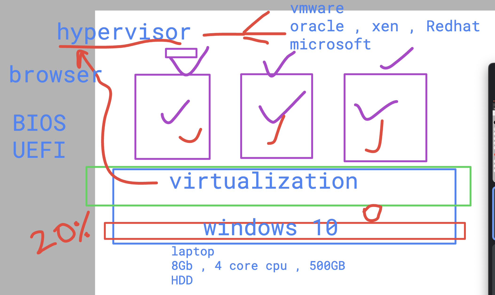

# Devops_targetJuly2025

### Installation options in single machine / laptop/pc hardware

### Introduction to hypervisor 

## Downlaod Virtualbox 

[click_here](https://www.virtualbox.org/wiki/Downloads)

### Download ubuntu 

[click_here](https://ubuntu.com/download/desktop)

### basic info about OS 

### Windows storage understanding 

### linux based user storage 

