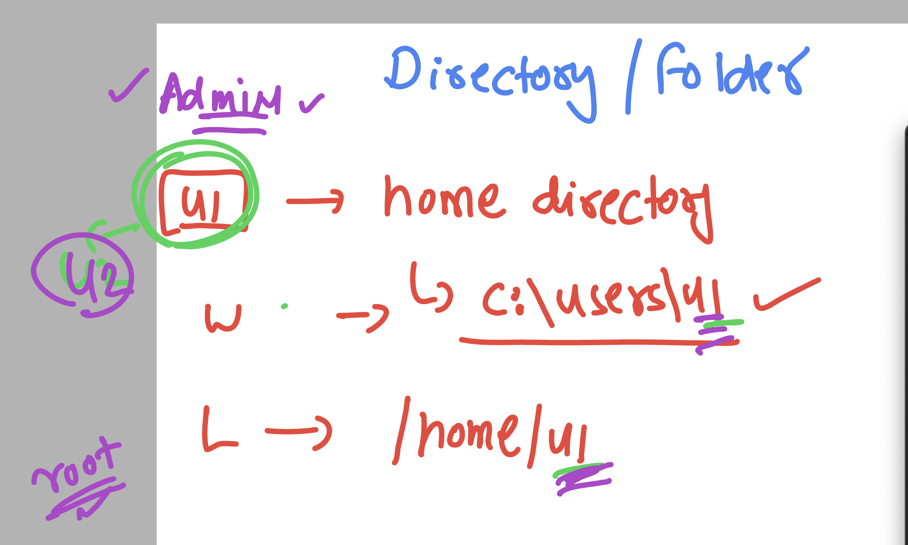

### users home directory location 



### Creating empty fold and deleting empty

```

PS C:\Users\hp\Desktop> mkdir  ashu


    Directory: C:\Users\hp\Desktop


Mode                 LastWriteTime         Length Name
----                 -------------         ------ ----
d-----          3/9/2025   1:14 AM                ashu


PS C:\Users\hp\Desktop> ls


    Directory: C:\Users\hp\Desktop


Mode                 LastWriteTime         Length Name
----                 -------------         ------ ----
d-----          3/9/2025   1:14 AM                ashu
d-----          5/1/2024  12:14 AM                codes
d-----          5/1/2024  12:14 AM                course_materials
d-----        11/25/2024   2:30 AM                flask_project
d-----          3/5/2025   1:48 AM                testtt
-a----        10/18/2024   8:33 AM             10 datacapture.txt
-a----          5/5/2024  10:15 PM           2332 MongoDBCompass.lnk
-a----         1/21/2022   2:13 AM       11873274 rh318-4.3-student-guide.pdf
-a----          5/8/2024  12:45 AM           1395 Visual Studio Code.lnk
-a----         3/17/2024  10:29 PM            893 µTorrent.lnk


PS C:\Users\hp\Desktop> rmdir  ashu
PS C:\Users\hp\Desktop> ls


    Directory: C:\Users\hp\Desktop


Mode                 LastWriteTime         Length Name
----                 -------------         ------ ----
d-----          5/1/2024  12:14 AM                codes
d-----          5/1/2024  12:14 AM                course_materials
d-----        11/25/2024   2:30 AM                flask_project

```

## Now we can start with linux commands only 

### commands 

### checking current loging username 

```
wetravel15122021@cloudshell:~$ 
wetravel15122021@cloudshell:~$ whoami
wetravel15122021

wetravel15122021@cloudshell:~$ pwd
/home/wetravel15122021
wetravel15122021@cloudshell:~$ 

```

## creating multi dir

```
$ 
wetravel15122021@cloudshell:~$ mkdir  hio hello opkey 
wetravel15122021@cloudshell:~$ ls
hello  hio  opkey  README-cloudshell.txt
wetravel15122021@cloudshell:~$ 
wetravel15122021@cloudshell:~$ 
wetravel15122021@cloudshell:~$ rmdir  hio hello opkey 
wetravel15122021@cloudshell:~$ ls
README-cloudshell.txt
wetravel15122021@cloudshell:~$ 


```

### using {start..end}

```
wetravel15122021@cloudshell:~$ mkdir ashu{1..10}  
wetravel15122021@cloudshell:~$ ls
ashu1  ashu10  ashu2  ashu3  ashu4  ashu5  ashu6  ashu7  ashu8  ashu9  README-cloudshell.txt
wetravel15122021@cloudshell:~$ 
wetravel15122021@cloudshell:~$ rmdir ashu{1..10}  
wetravel15122021@cloudshell:~$ ls
README-cloudshell.txt
wetravel15122021@cloudshell:~$ 

```

