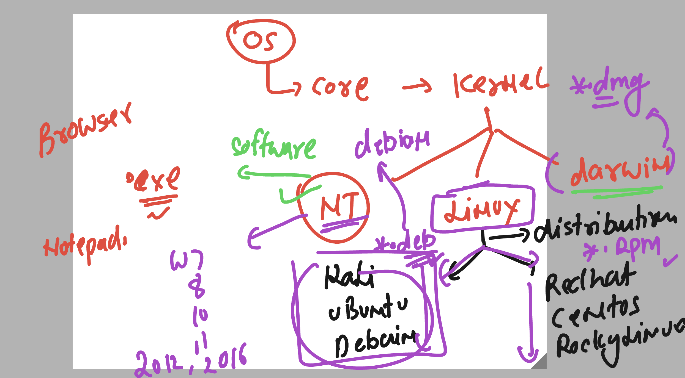
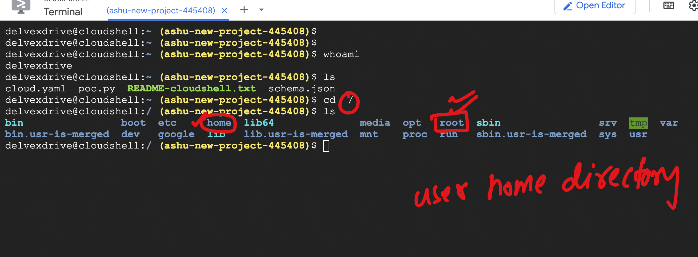
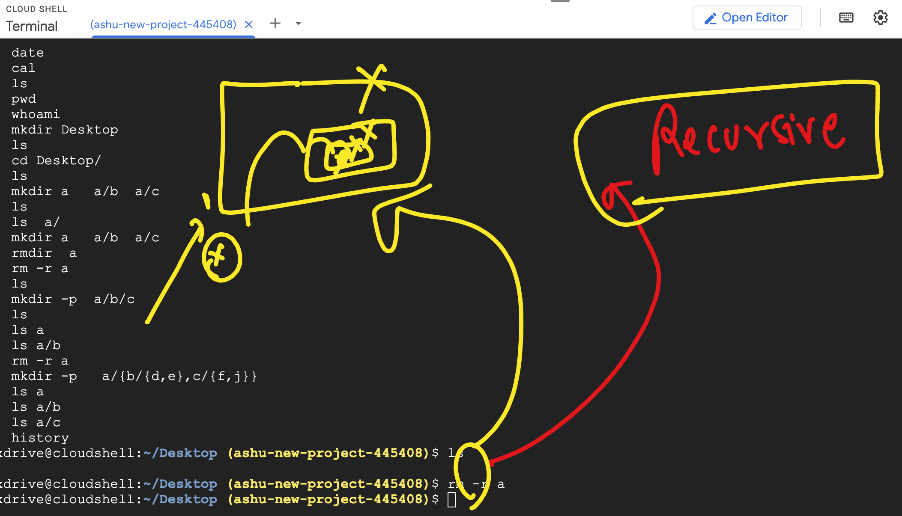
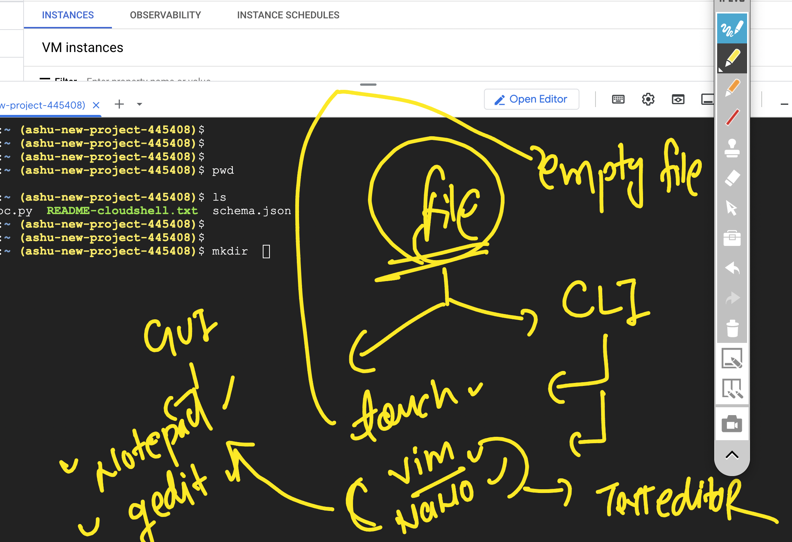
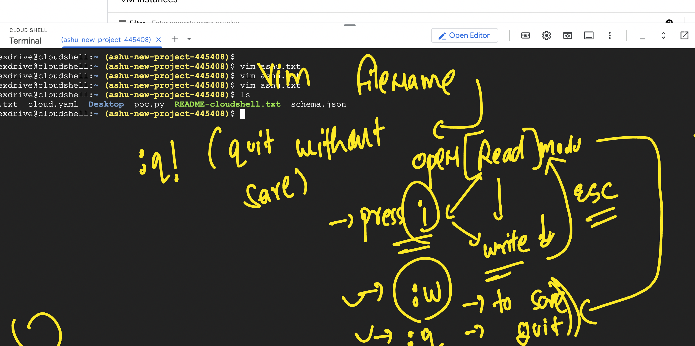

## Linux kernel base distributions 



### few comamnds about user 

```
delvexdrive@cloudshell:~ (ashu-new-project-445408)$ whoami
delvexdrive
delvexdrive@cloudshell:~ (ashu-new-project-445408)$ pwd
/home/delvexdrive
delvexdrive@cloudshell:~ (ashu-new-project-445408)$ 

```

### LInux directory structure 

:- /  , /root , /home 



### more basic of cd and ls command 

```
cloud.yaml  poc.py  README-cloudshell.txt  schema.json
delvexdrive@cloudshell:~ (ashu-new-project-445408)$ cd  / 
delvexdrive@cloudshell:/ (ashu-new-project-445408)$ ls
bin                boot  etc     home  lib64              media  opt   root  sbin                srv  tmp  var
bin.usr-is-merged  dev   google  lib   lib.usr-is-merged  mnt    proc  run   sbin.usr-is-merged  sys  usr
delvexdrive@cloudshell:/ (ashu-new-project-445408)$ cd root 
delvexdrive@cloudshell:/root (ashu-new-project-445408)$ ls
delvexdrive@cloudshell:/root (ashu-new-project-445408)$ pwd
/root
delvexdrive@cloudshell:/root (ashu-new-project-445408)$ cd ..
delvexdrive@cloudshell:/ (ashu-new-project-445408)$ ls
bin                boot  etc     home  lib64              media  opt   root  sbin                srv  tmp  var
bin.usr-is-merged  dev   google  lib   lib.usr-is-merged  mnt    proc  run   sbin.usr-is-merged  sys  usr
delvexdrive@cloudshell:/ (ashu-new-project-445408)$ cd home/
delvexdrive@cloudshell:/home (ashu-new-project-445408)$ ls
delvexdrive  lost+found
delvexdrive@cloudshell:/home (ashu-new-project-445408)$ cd delvexdrive/
delvexdrive@cloudshell:~ (ashu-new-project-445408)$ ls
cloud.yaml  poc.py  README-cloudshell.txt  schema.json

```

### info about date command 

```
delvexdrive@cloudshell:~ (ashu-new-project-445408)$ date
Mon Mar 17 09:55:07 AM UTC 2025
delvexdrive@cloudshell:~ (ashu-new-project-445408)$ 
delvexdrive@cloudshell:~ (ashu-new-project-445408)$ 
delvexdrive@cloudshell:~ (ashu-new-project-445408)$ 
delvexdrive@cloudshell:~ (ashu-new-project-445408)$ date +%T
09:55:56
delvexdrive@cloudshell:~ (ashu-new-project-445408)$ date +%Y
2025
delvexdrive@cloudshell:~ (ashu-new-project-445408)$ date +%A
Monday
delvexdrive@cloudshell:~ (ashu-new-project-445408)$ date +%a
Mon
delvexdrive@cloudshell:~ (ashu-new-project-445408)$ 

```

### you can use --help with any command to check options inside that command 

### checking calender 

```
 humanfirmware@darwin  ~  cal 
     March 2025       
Su Mo Tu We Th Fr Sa  
                   1  
 2  3  4  5  6  7  8  
 9 10 11 12 13 14 15  
16 17 18 19 20 21 22  
23 24 25 26 27 28 29  
30 31                 
 humanfirmware@darwin  ~  cal    2025 
                            2025
      January               February               March          
Su Mo Tu We Th Fr Sa  Su Mo Tu We Th Fr Sa  Su Mo Tu We Th Fr Sa  
          1  2  3  4                     1                     1  
 5  6  7  8  9 10 11   2  3  4  5  6  7  8   2  3  4  5  6  7  8  
12 13 14 15 16 17 18   9 10 11 12 13 14 15   9 10 11 12 13 14 15  
19 20 21 22 23 24 25  16 17 18 19 20 21 22  16 17 18 19 20 21 22  
26 27 28 29 30 31     23 24 25 26 27 28     23 24 25 26 27 28 29  
                                            30 31                 


===>
 humanfirmware@darwin  ~  cal   1   2025 
    January 2025      
Su Mo Tu We Th Fr Sa  
          1  2  3  4  
 5  6  7  8  9 10 11  
12 13 14 15 16 17 18  
19 20 21 22 23 24 25  
26 27 28 29 30 31     
                      
 humanfirmware@darwin  ~  cal   2  2025  
   February 2025      
Su Mo Tu We Th Fr Sa  
                   1  
 2  3  4  5  6  7  8  
 9 10 11 12 13 14 15  
16 17 18 19 20 21 22  
23 24 25 26 27 28     
                      


```

### info about mkdir 

```
delvexdrive@cloudshell:~ (ashu-new-project-445408)$ pwd
/home/delvexdrive
delvexdrive@cloudshell:~ (ashu-new-project-445408)$ whoami
delvexdrive
delvexdrive@cloudshell:~ (ashu-new-project-445408)$ mkdir Desktop 
delvexdrive@cloudshell:~ (ashu-new-project-445408)$ ls
cloud.yaml  Desktop  poc.py  README-cloudshell.txt  schema.json
delvexdrive@cloudshell:~ (ashu-new-project-445408)$ cd Desktop/
delvexdrive@cloudshell:~/Desktop (ashu-new-project-445408)$ ls
delvexdrive@cloudshell:~/Desktop (ashu-new-project-445408)$ mkdir a   a/b  a/c 
delvexdrive@cloudshell:~/Desktop (ashu-new-project-445408)$ ls 
a
delvexdrive@cloudshell:~/Desktop (ashu-new-project-445408)$ ls  a/
b  c
delvexdrive@cloudshell:~/Desktop (ashu-new-project-445408)$ mkdir a   a/b  a/c 
mkdir: cannot create directory ‘a’: File exists
mkdir: cannot create directory ‘a/b’: File exists
mkdir: cannot create directory ‘a/c’: File exists
delvexdrive@cloudshell:~/Desktop (ashu-new-project-445408)$ rmdir  a 
rmdir: failed to remove 'a': Directory not empty
delvexdrive@cloudshell:~/Desktop (ashu-new-project-445408)$ rm -r a 
delvexdrive@cloudshell:~/Desktop (ashu-new-project-445408)$ ls
delvexdrive@cloudshell:~/Desktop (ashu-new-project-445408)$ mkdir -p  a/b/c 
delvexdrive@cloudshell:~/Desktop (ashu-new-project-445408)$ ls 
a
delvexdrive@cloudshell:~/Desktop (ashu-new-project-445408)$ ls a
b
delvexdrive@cloudshell:~/Desktop (ashu-new-project-445408)$ ls a/b
c
delvexdrive@cloudshell:~/Desktop (ashu-new-project-445408)$ rm -r a
delvexdrive@cloudshell:~/Desktop (ashu-new-project-445408)$ mkdir -p   a/{b/{d,e},c/{f,j}} 
delvexdrive@cloudshell:~/Desktop (ashu-new-project-445408)$ ls a
b  c
delvexdrive@cloudshell:~/Desktop (ashu-new-project-445408)$ ls a/b
d  e
delvexdrive@cloudshell:~/Desktop (ashu-new-project-445408)$ ls a/c
f  j

```

## Removing a non empty directory 



### Going to back to home directory using ~ 

```
 delvexdrive@cloudshell:~/Desktop (ashu-new-project-445408)$ pwd
/home/delvexdrive/Desktop
delvexdrive@cloudshell:~/Desktop (ashu-new-project-445408)$ cd  /tmp/
delvexdrive@cloudshell:/tmp (ashu-new-project-445408)$ pwd
/tmp
delvexdrive@cloudshell:/tmp (ashu-new-project-445408)$ cd  ~ 
delvexdrive@cloudshell:~ (ashu-new-project-445408)$ pwd
/home/delvexdrive
delvexdrive@cloudshell:~ (ashu-new-project-445408)$ cd  /tmp/
delvexdrive@cloudshell:/tmp (ashu-new-project-445408)$ pwd
/tmp
delvexdrive@cloudshell:/tmp (ashu-new-project-445408)$ cd 
delvexdrive@cloudshell:~ (ashu-new-project-445408)$ pwd
/home/delvexdrive
delvexdrive@cloudshell:~ (ashu-new-project-445408)$ 


```

### Text Editor in linux kernel 



### Creating and removing text file 

```
delvexdrive@cloudshell:~ (ashu-new-project-445408)$ touch hello.txt 
delvexdrive@cloudshell:~ (ashu-new-project-445408)$ ls
cloud.yaml  Desktop  hello.txt  poc.py  README-cloudshell.txt  schema.json
delvexdrive@cloudshell:~ (ashu-new-project-445408)$ 
delvexdrive@cloudshell:~ (ashu-new-project-445408)$ rm  hello.txt 
delvexdrive@cloudshell:~ (ashu-new-project-445408)$ ls
cloud.yaml  Desktop  poc.py  README-cloudshell.txt  schema.json
delvexdrive@cloudshell:~ (ashu-new-project-445408)$ 


```

### info about VIm 



