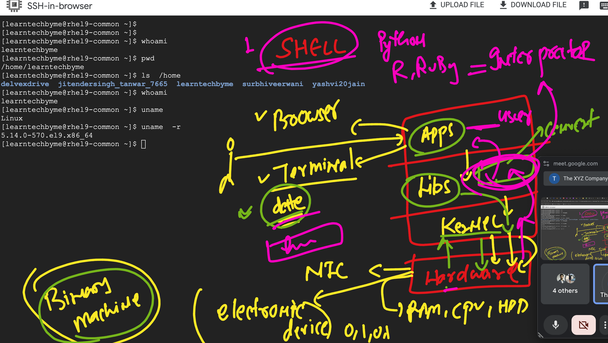
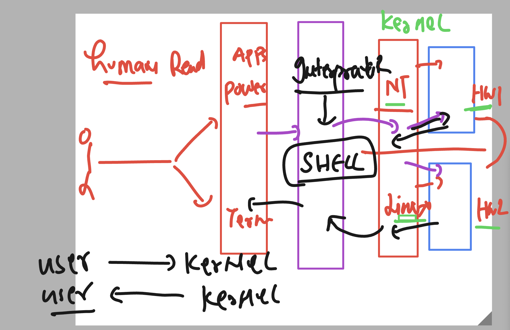
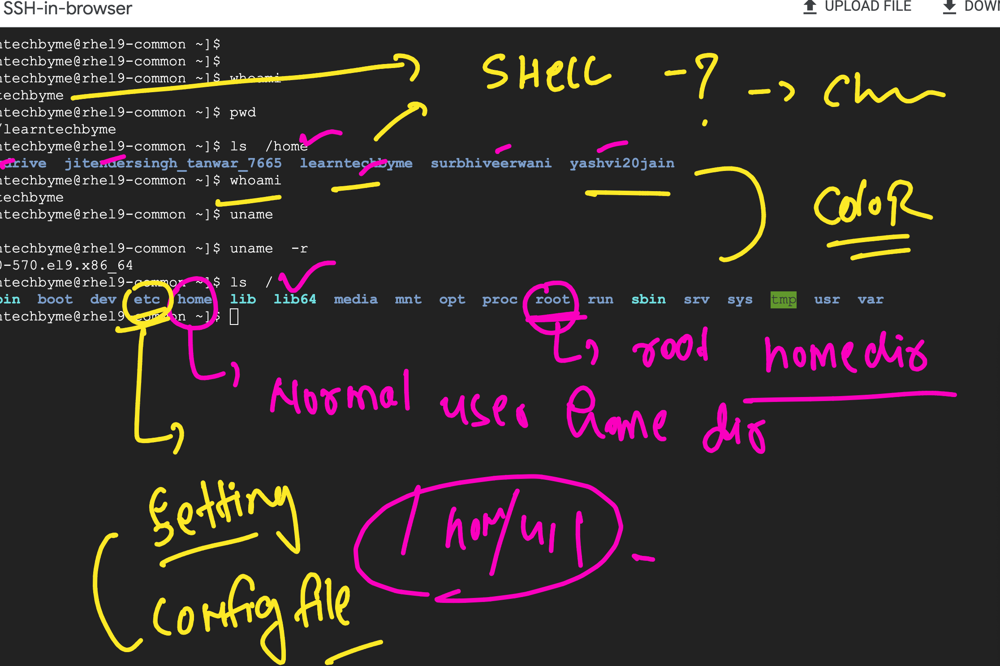
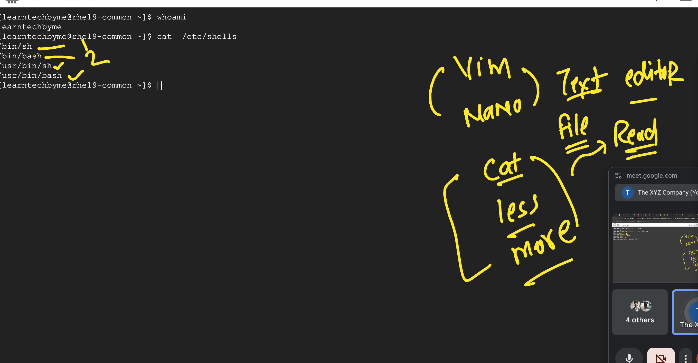

### Linux kernel Distro 

### checking basic details

```
learntechbyme@rhel9-common ~]$ 
[learntechbyme@rhel9-common ~]$ 
[learntechbyme@rhel9-common ~]$ whoami
learntechbyme
[learntechbyme@rhel9-common ~]$ pwd
/home/learntechbyme
[learntechbyme@rhel9-common ~]$ ls  /home
delvexdrive  jitendersingh_tanwar_7665  learntechbyme  surbhiveerwani  yashvi20jain
[learntechbyme@rhel9-common ~]$ whoami 
learntechbyme
[learntechbyme@rhel9-common ~]$ uname 
Linux
[learntechbyme@rhel9-common ~]$ uname  -r
5.14.0-570.el9.x86_64
[learntechbyme@rhel9-common ~]$ 

```

## Interprator in OS 



### Intro to SHELL 



### understanding /etc 



### checking detail

```
learntechbyme@rhel9-common ~]$ pwd
/home/learntechbyme
[learntechbyme@rhel9-common ~]$ ls  /
afs  bin  boot  dev  etc  home  lib  lib64  media  mnt  opt  proc  root  run  sbin  srv  sys  tmp  usr  var
[learntechbyme@rhel9-common ~]$ 
[learntechbyme@rhel9-common ~]$ 
[learntechbyme@rhel9-common ~]$ cd  /etc
[learntechbyme@rhel9-common etc]$ ls
acpi               dbus-1                   grub2.cfg      libblockdev               nvme                  rpc            sudo-ldap.conf
adjtime            debuginfod               grub2-efi.cfg  libnl                     openldap              rpm            sysconfig
aliases            default                  grub.d         libreport                 opt                   rsyslog.conf   sysctl.conf
alternatives       depmod.d                 gshadow        libssh                    oslogin_group.cache   rsyslog.d      sysctl.d
anacrontab         dhcp                     gshadow-       libuser.conf              oslogin_passwd.cache  rwtab.d        systemd
audit              DIR_COLORS               gss            locale.conf               os-release            sasl2          system-release
authselect         DIR_COLORS.lightbgcolor  host.conf      localtime                 pam.d                 security       system-release-cpe
bash_completion.d  dnf                      hostname       login.defs                passwd                selinux        terminfo
bashrc             dracut.conf              hosts          logrotate.conf            passwd-               services       tmpfiles.d
binfmt.d           dracut.conf.d            inittab        logrotate.d               pkcs11                sestatus.conf  tpm2-tss
centos-release     environment              inputrc  

```

### checking all available shells 



### using echo command 

```
learntechbyme@rhel9-common ~]$ echo  hello
hello
[learntechbyme@rhel9-common ~]$ echo  10
10
[learntechbyme@rhel9-common ~]$ x=100
[learntechbyme@rhel9-common ~]$ 
[learntechbyme@rhel9-common ~]$ echo x
x
[learntechbyme@rhel9-common ~]$ echo $x
100
[learntechbyme@rhel9-common ~]$ 

```

### checking current user shell

```
[learntechbyme@rhel9-common ~]$ echo $SHELL
/bin/bash
[learntechbyme@rhel9-common ~]$ whoami
learntechbyme
[learntechbyme@rhel9-common ~]$ 


===>
ntechbyme@rhel9-common ~]$ whoami
learntechbyme
[learntechbyme@rhel9-common ~]$ echo $USER
learntechbyme
[learntechbyme@rhel9-common ~]$ echo $LANG
en_US.UTF-8
```
