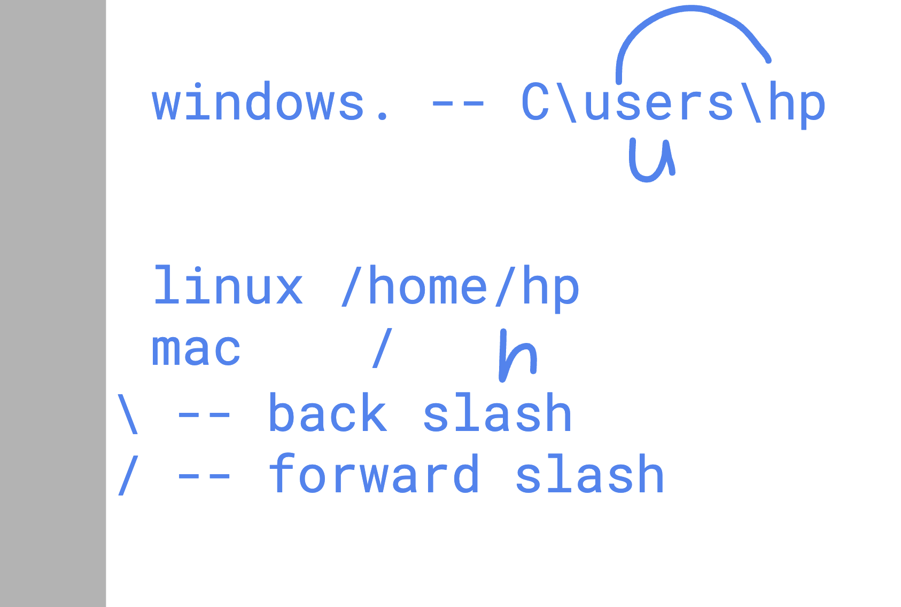

# COmmands in windows cmd /powershell

### checking ip address 

```
ipConFig

Windows IP Configuration


Ethernet adapter Ethernet:

   Media State . . . . . . . . . . . : Media disconnected
   Connection-specific DNS Suffix  . :

Wireless LAN adapter Local Area Connection* 9:

   Media State . . . . . . . . . . . : Media disconnected
   Connection-specific DNS Suffix  . :

Wireless LAN adapter Local Area Connection* 10:

   Media State . . . . . . . . . . . : Media disconnected
   Connection-specific DNS Suffix  . :

Ethernet adapter VMware Network Adapter VMnet1:

   Connection-specific DNS Suffix  . :
   Link-local IPv6 Address . . . . . : fe80::ddc6:49c1:6b40:1a79%13
   IPv4 Address. . . . . . . . . . . : 192.168.237.1
   Subnet Mask . . . . . . . . . . . : 255.255.255.0
   Default Gateway . . . . . . . . . :

```

### checking current path / location 

```
PS C:\Users\hp> pwd

Path
----
C:\Users\hp

```

### checking content of current folder / directory 

```

PS C:\Users\hp> ls


    Directory: C:\Users\hp


Mode                 LastWriteTime         Length Name
----                 -------------         ------ ----
d-----        11/23/2024   7:07 PM                .appscan
d-----         8/12/2024   3:47 AM                .aws
d-----          2/7/2022  10:34 PM                .azure
d-----          4/9/2024  10:32 PM                .cdk
d-----         6/10/2022   6:01 AM                .dlv
d-----          5/8/2024   3:54 AM                .docker
d-----          2/6/2022   7:02 PM                .dotnet
d-----          6/8/2024   5:11 AM                .kube
d-----         4/18/2023  10:20 PM                .kuberlr
d-----         8/10/2023  10:19 PM                .minikube
d-----         1/30/2024  10:30 PM                .redhat
d-----          6/6/2024  12:12 AM                .splunk
d-----          3/3/2025   9:53 AM                .ssh
```

### Changing directory / kisi folder k andar jana 

```
PS C:\Users\hp>cd        Desktop
PS C:\Users\hp\Desktop> pwd

Path
----
C:\Users\hp\Desktop
```

### going one directory behind 

```

PS C:\Users\hp> cd ..
PS C:\Users> pwd

Path
----
C:\Users

```

### Understanding directory seperator in linux / windows



### changing multiple directory 

```

PS C:\> cd Users\hp
PS C:\Users\hp> pwd

Path
----
C:\Users\hp

```

### absolute path 

```
PS C:\> cd C:\Users\hp\Downloads

```
### Relative path 

```
PS C:\Users\hp\Desktop> pwd

Path
----
C:\Users\hp\Desktop


PS C:\Users\hp\Desktop> cd ..
PS C:\Users\hp> cd Downloads
PS C:\Users\hp\Downloads>

```
