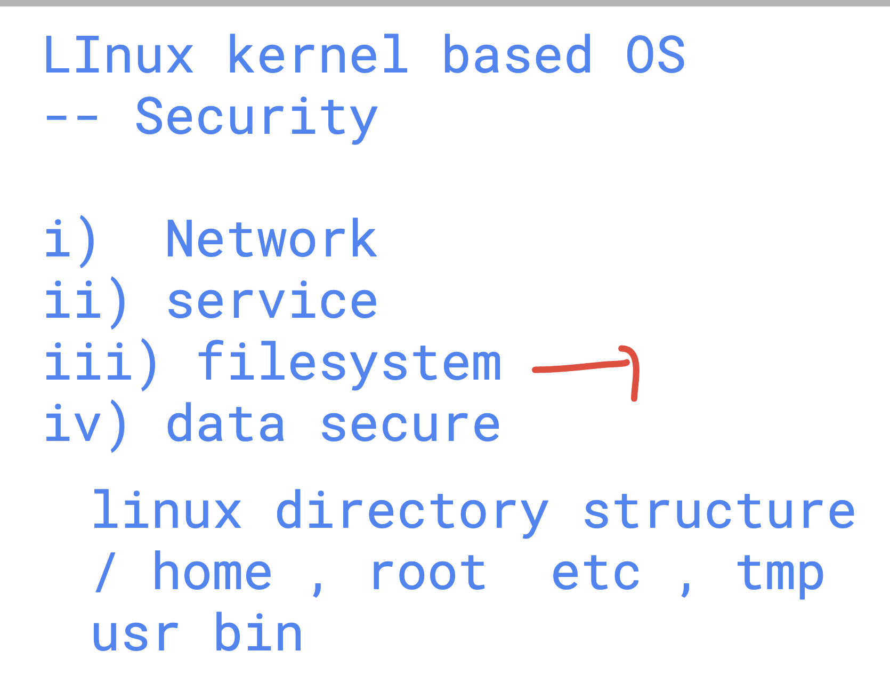
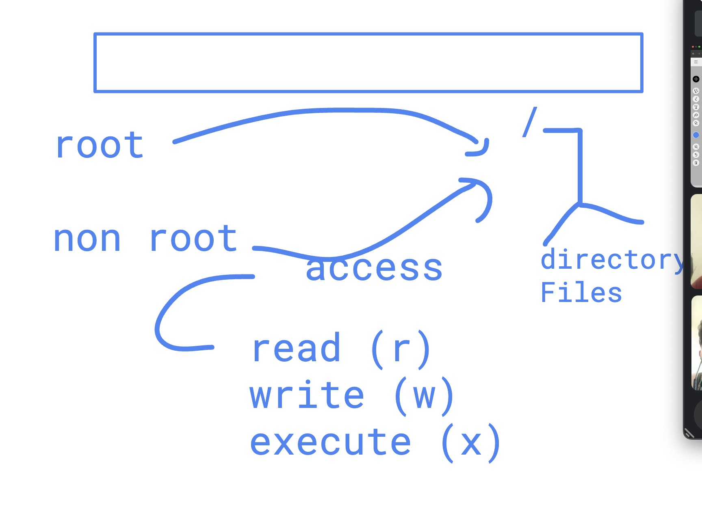
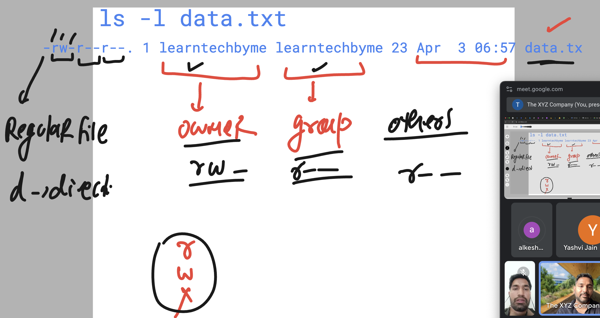
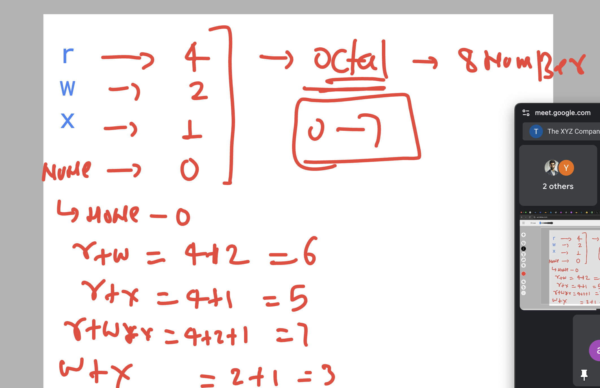

# Permission in Linux kernel 

### linux Directory structure security 



### permission in linux kernel for files and folder 



### checking permission in linux 



### changing permission for date command 

```
[root@rhel9-common ~]# chmod   o-x   /usr/bin/date
[root@rhel9-common ~]# 
[root@rhel9-common ~]# ls -l  /usr/bin/date
-rwxr-xr--. 1 root root 106536 Mar 22 08:18 /usr/bin/date
[root@rhel9-common ~]# 

===>>

[root@rhel9-common ~]# chmod o+x   /usr/bin/date
[root@rhel9-common ~]# 
[root@rhel9-common ~]# ls -l  /usr/bin/date
-rwxr-xr-x. 1 root root 106536 Mar 22 08:18 /usr/bin/date
[root@rhel9-common ~]# 


===>
[root@rhel9-common ~]# chmod o-r  /common/
[root@rhel9-common ~]# 
[root@rhel9-common ~]# ls  -ld  /common/
drwxr-x--x. 3 root root 32 Apr  3 07:19 /common/
[root@rhel9-common ~]# 


====>
[root@rhel9-common ~]# chmod o-rwx  /common/
[root@rhel9-common ~]# 
[root@rhel9-common ~]# ls  -ld /common/
drwxr-x---. 6 root root 68 Apr  3 07:26 /common/
[root@rhel9-common ~]# 
[root@rhel9-common ~]# chmod o+rwx  /common/
[root@rhel9-common ~]# 
[root@rhel9-common ~]# ls  -ld /common/
drwxr-xrwx. 6 root root 68 Apr  3 07:26 /common/
[root@rhel9-common ~]# 


====>

[learntechbyme@rhel9-common ~]$ ls -l
total 16
-rw-r--r--. 1 learntechbyme learntechbyme 897 Mar 29 08:01 ashu.txt
-rw-r--r--. 1 learntechbyme learntechbyme   4 Mar 29 08:12 char.txt
-rw-r--r--. 1 learntechbyme learntechbyme  23 Apr  3 06:57 data.txt
-rw-r--r--. 1 learntechbyme learntechbyme  22 Mar 18 08:21 hello.txt
drwxr-xr-x. 2 learntechbyme learntechbyme  18 Mar 21 07:07 mycommands
[learntechbyme@rhel9-common ~]$ 
[learntechbyme@rhel9-common ~]$ 
[learntechbyme@rhel9-common ~]$ chmod g+w  data.txt 
[learntechbyme@rhel9-common ~]$ 
[learntechbyme@rhel9-common ~]$ ls -l
total 16
-rw-r--r--. 1 learntechbyme learntechbyme 897 Mar 29 08:01 ashu.txt
-rw-r--r--. 1 learntechbyme learntechbyme   4 Mar 29 08:12 char.txt
-rw-rw-r--. 1 learntechbyme learntechbyme  23 Apr  3 06:57 data.txt
-rw-r--r--. 1 learntechbyme learntechbyme  22 Mar 18 08:21 hello.txt
drwxr-xr-x. 2 learntechbyme learntechbyme  18 Mar 21 07:07 mycommands
[learntechbyme@rhel9-common ~]$ 
[learntechbyme@rhel9-common ~]$ chmod o+rx  data.txt 
[learntechbyme@rhel9-common ~]$ 
[learntechbyme@rhel9-common ~]$ ls -l
total 16
-rw-r--r--. 1 learntechbyme learntechbyme 897 Mar 29 08:01 ashu.txt
-rw-r--r--. 1 learntechbyme learntechbyme   4 Mar 29 08:12 char.txt
-rw-rw-r-x. 1 learntechbyme learntechbyme  23 Apr  3 06:57 data.txt
-rw-r--r--. 1 learntechbyme learntechbyme  22 Mar 18 08:21 hello.txt
drwxr-xr-x. 2 learntechbyme learntechbyme  18 Mar 21 07:07 mycommands
[learntechbyme@rhel9-common ~]$ chmod u+rx  data.txt 
[learntechbyme@rhel9-common ~]$ 
[learntechbyme@rhel9-common ~]$ ls -l 
total 16
-rw-r--r--. 1 learntechbyme learntechbyme 897 Mar 29 08:01 ashu.txt
-rw-r--r--. 1 learntechbyme learntechbyme   4 Mar 29 08:12 char.txt
-rwxrw-r-x. 1 learntechbyme learntechbyme  23 Apr  3 06:57 data.txt
-rw-r--r--. 1 learntechbyme learntechbyme  22 Mar 18 08:21 hello.txt


====>

learntechbyme@rhel9-common ~]$ ls -l  data.txt 
-rwxrw-r-x. 1 learntechbyme learntechbyme 23 Apr  3 06:57 data.txt
[learntechbyme@rhel9-common ~]$ chmod a-rwx  data.txt 
[learntechbyme@rhel9-common ~]$ 
[learntechbyme@rhel9-common ~]$ ls -l  data.txt 
----------. 1 learntechbyme learntechbyme 23 Apr  3 06:57 data.txt
[learntechbyme@rhel9-common ~]$ 
[learntechbyme@rhel9-common ~]$ 
[learntechbyme@rhel9-common ~]$ chmod a+rwx  data.txt 
[learntechbyme@rhel9-common ~]$ 
[learntechbyme@rhel9-common ~]$ ls -l  data.txt 
-rwxrwxrwx. 1 learntechbyme learntechbyme 23 Apr  3 06:57 data.txt
[learntechbyme@rhel9-common ~]$ 
[learntechbyme@rhel9-common ~]$ chmod a-rwx  data.txt 
[learntechbyme@rhel9-common ~]$ 
[learntechbyme@rhel9-common ~]$ ls -l  data.txt 
----------. 1 learntechbyme learntechbyme 23 Apr  3 06:57 data.txt
[learntechbyme@rhel9-common ~]$ 
[learntechbyme@rhel9-common ~]$ chmod u+rwx,g+rx,o+r   data.txt 
[learntechbyme@rhel9-common ~]$ 
[learntechbyme@rhel9-common ~]$ ls -l  data.txt 
-rwxr-xr--. 1 learntechbyme learntechbyme 23 Apr  3 06:57 data.txt
[learntechbyme@rhel9-common ~]$ 


```

### Assigning permission with octal number system 



### chmod with numbers

```
[learntechbyme@rhel9-common ~]$ chmod u+rw,g+rx,o+r   data.txt 
[learntechbyme@rhel9-common ~]$ 
[learntechbyme@rhel9-common ~]$ 
[learntechbyme@rhel9-common ~]$ ls -l data.txt 
-rwxr-xr--. 1 learntechbyme learntechbyme 23 Apr  3 06:57 data.txt
[learntechbyme@rhel9-common ~]$ 
[learntechbyme@rhel9-common ~]$ chmod a-rxw  data.txt 
[learntechbyme@rhel9-common ~]$ 
[learntechbyme@rhel9-common ~]$ ls -l data.txt 
----------. 1 learntechbyme learntechbyme 23 Apr  3 06:57 data.txt
[learntechbyme@rhel9-common ~]$ 
[learntechbyme@rhel9-common ~]$ chmod  654  data.txt 
[learntechbyme@rhel9-common ~]$ 
[learntechbyme@rhel9-common ~]$ ls -l data.txt 
-rw-r-xr--. 1 learntechbyme learntechbyme 23 Apr  3 06:57 data.txt
[learntechbyme@rhel9-common ~]$ 
[learntechbyme@rhel9-common ~]$ chmod 740   data.txt 
[learntechbyme@rhel9-common ~]$ 
[learntechbyme@rhel9-common ~]$ ls -l data.txt 
-rwxr-----. 1 learntechbyme learntechbyme 23 Apr  3 06:57 data.txt
[learntechbyme@rhel9-common ~]$ 
[learntechbyme@rhel9-common ~]$ chmod  000  data.txt 
[learntechbyme@rhel9-common ~]$ 
[learntechbyme@rhel9-common ~]$ ls -l data.txt 
----------. 1 learntechbyme learntechbyme 23 Apr  3 06:57 data.txt
[learntechbyme@rhel9-common ~]$ 
[learntechbyme@rhel9-common ~]$ chmod  777  data.txt 
[learntechbyme@rhel9-common ~]$ 
[learntechbyme@rhel9-common ~]$ ls -l data.txt 
-rwxrwxrwx. 1 learntechbyme learntechbyme 23 Apr  3 06:57 data.txt
[learntechbyme@rhel9-common ~]$ 

```
