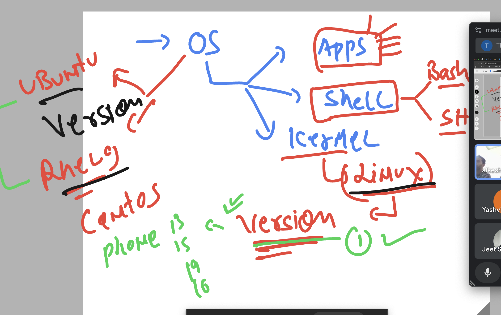
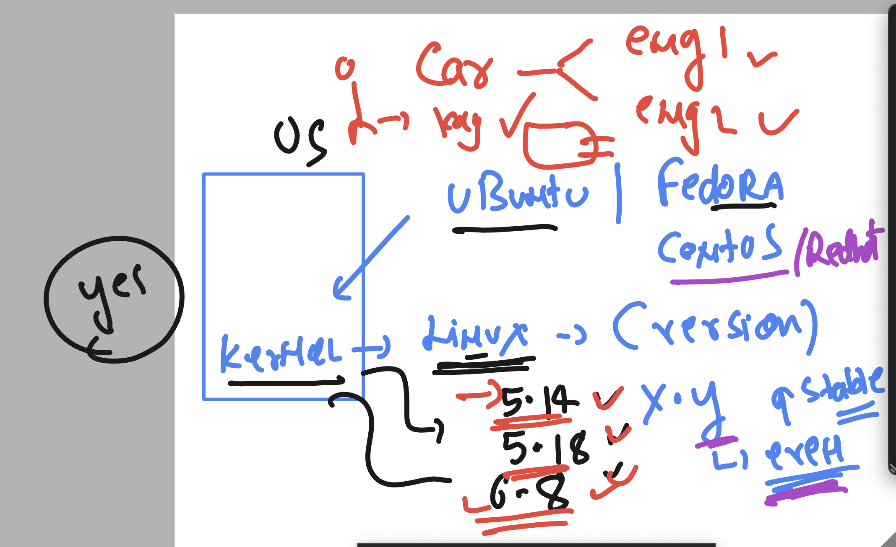
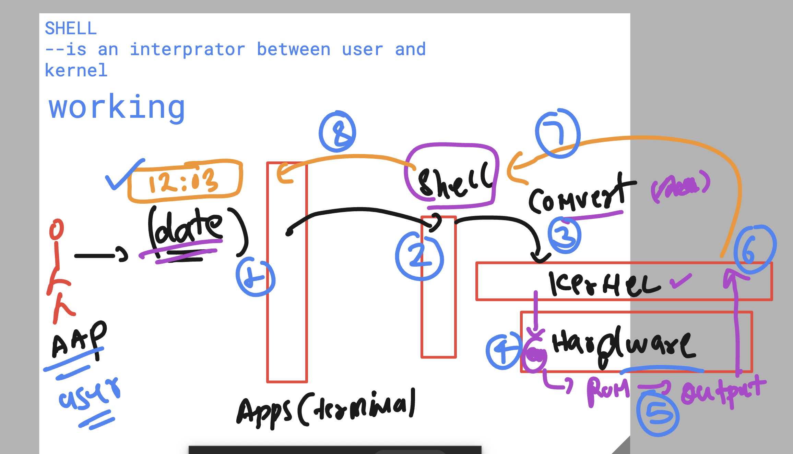
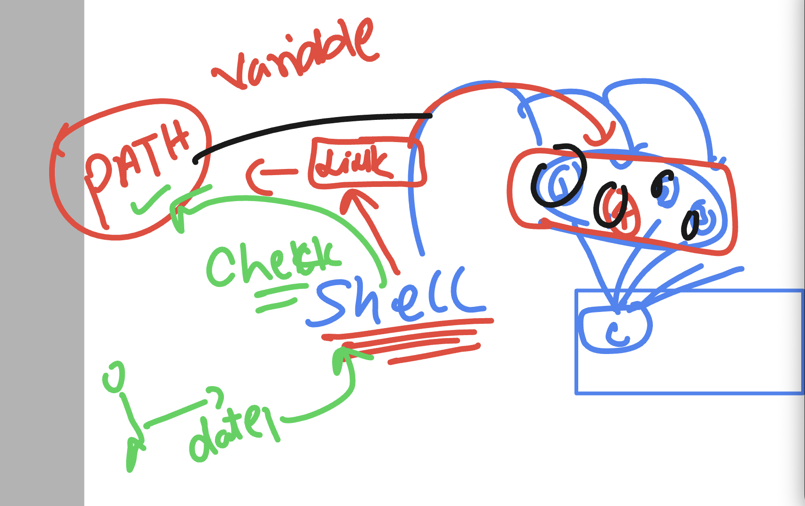
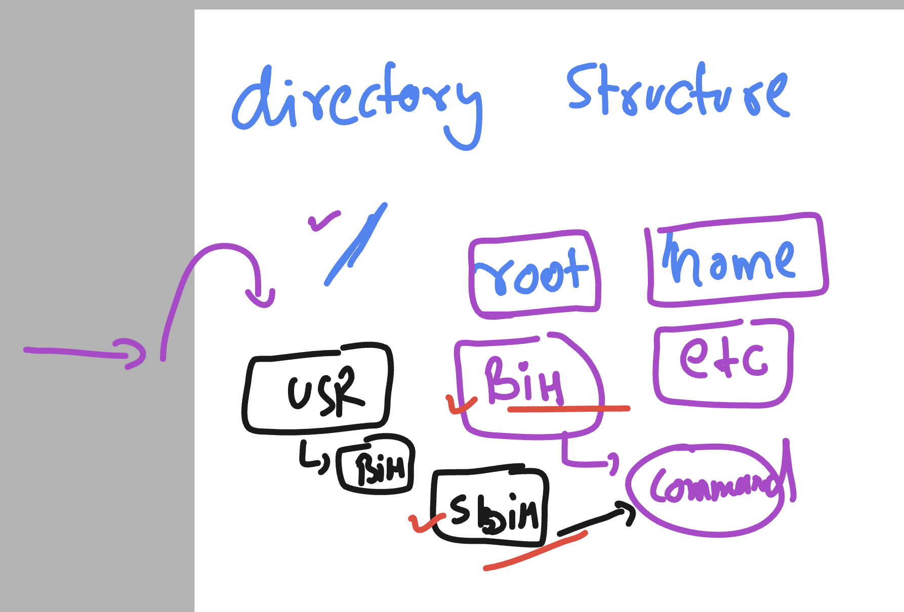

### Kernel vs OS 



### we can have more than one kernel in OS 



### Working of shell 



### Understanding PATH in OS for shell 



### Command Location 



### checking command location using which 

```
learntechbyme@rhel9-common ~]$ date
Thu Mar 20 07:16:17 AM UTC 2025
[learntechbyme@rhel9-common ~]$ 
[learntechbyme@rhel9-common ~]$ which  date 
/usr/bin/date
[learntechbyme@rhel9-common ~]$ ls  /
afs  bin  boot  dev  etc  home  lib  lib64  media  mnt  opt  proc  root  run  sbin  srv  sys  tmp  usr  var
[learntechbyme@rhel9-common ~]$ 
[learntechbyme@rhel9-common ~]$ 
[learntechbyme@rhel9-common ~]$ 
[learntechbyme@rhel9-common ~]$ which date
/usr/bin/date
[learntechbyme@rhel9-common ~]$ which ifconfig 
/usr/sbin/ifconfig
[learntechbyme@rhel9-common ~]$ which cal
/usr/bin/cal
[learntechbyme@rhel9-common ~]$ 

```
