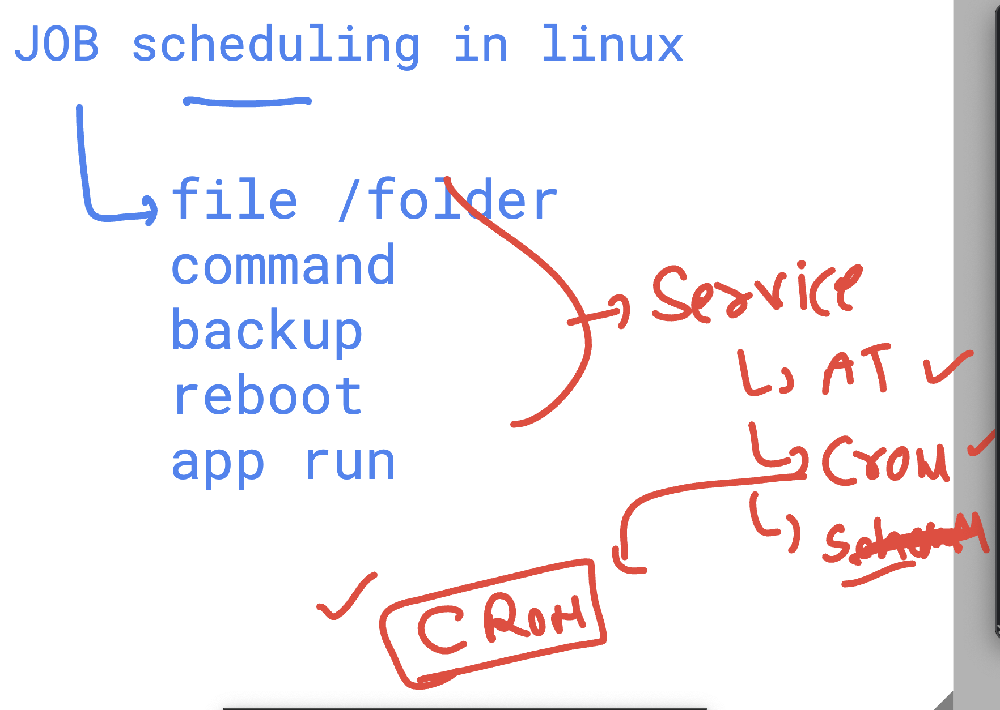
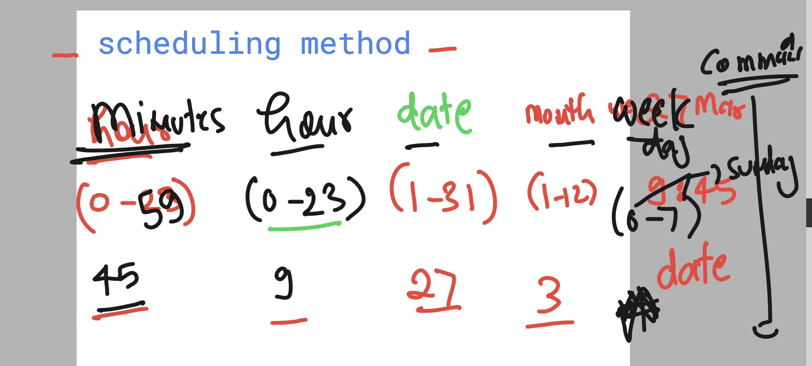

## JOb scheduling in linux 



### checking service of crond in linux (Centos)

```
[learntechbyme@rhel9-common ~]$ systemctl  status  crond 
● crond.service - Command Scheduler
     Loaded: loaded (/usr/lib/systemd/system/crond.service; enabled; preset: enabled)
     Active: active (running) since Fri 2025-03-21 06:37:22 UTC; 5 days ago
   Main PID: 1416 (crond)
      Tasks: 1 (limit: 23097)
     Memory: 1.3M
        CPU: 35.471s
     CGroup: /system.slice/crond.service
             └─1416 /usr/sbin/crond -n

```

### Cron job format 



### overall crontab in linux format 

```
[learntechbyme@rhel9-common ~]$ crontab -l
45  9  27  3  * date 
10  22 1  * * cal 
# 9:00 Am mon-friday
0 9  *  *  1-5  ls

59  23  1  1,3   *  echo hello


*/10 *  *  *  *  whoami

*/15 9-17 * * 1-5 pwd

@monthly    date
@weekly    date
@yearly    date
@hourly    date

```
