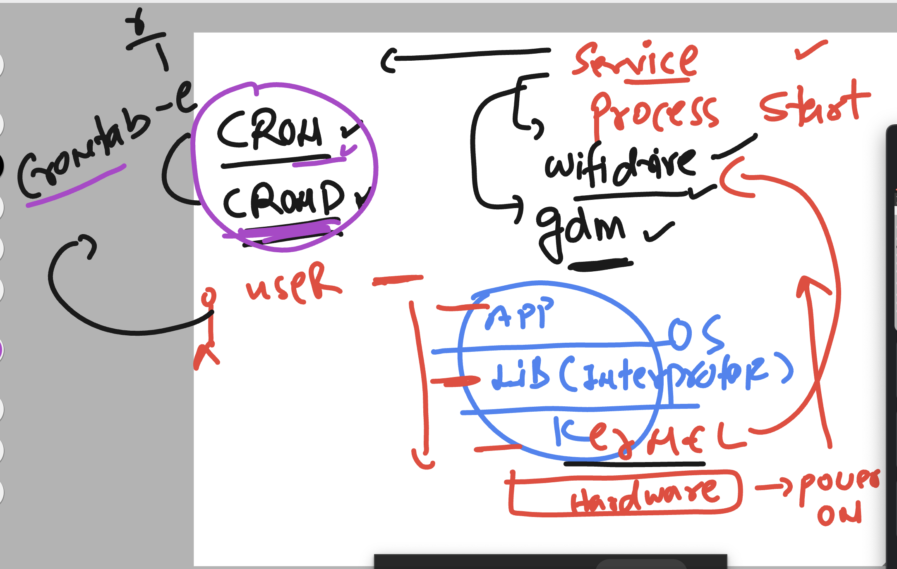
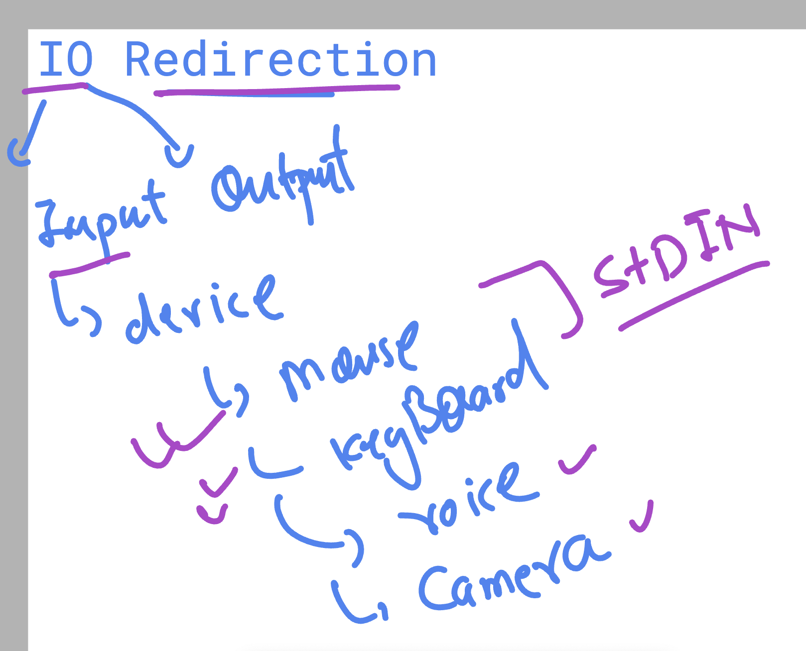
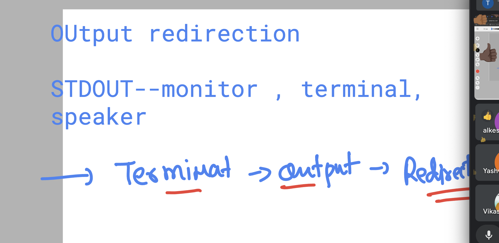
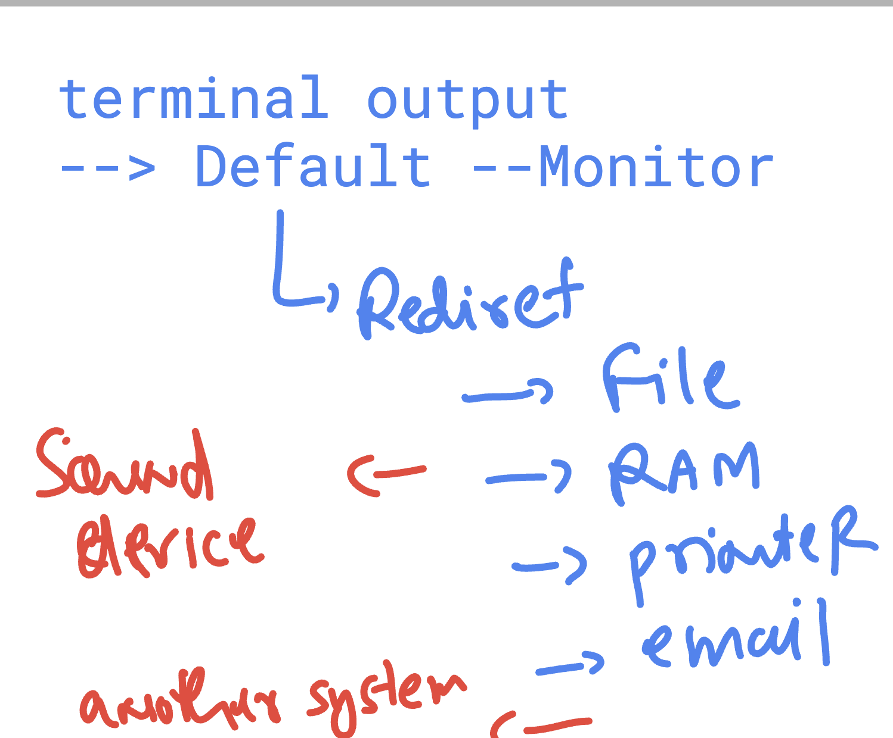
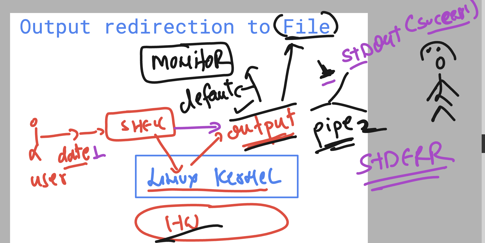

## Understanding USEr to kerne and Kernel to USEr process



### checking status of any service in Linux kernel based OS 

```
[learntechbyme@rhel9-common ~]$ whoami 
learntechbyme
[learntechbyme@rhel9-common ~]$ pwd
/home/learntechbyme
[learntechbyme@rhel9-common ~]$ systemctl status crond
● crond.service - Command Scheduler
     Loaded: loaded (/usr/lib/systemd/system/crond.service; enabled; preset: enabled)
     Active: active (running) since Fri 2025-03-28 06:41:28 UTC; 13min ago
   Main PID: 1420 (crond)
      Tasks: 1 (limit: 23097)
     Memory: 1.7M
        CPU: 234ms
     CGroup: /system.slice/crond.service
             └─1420 /usr/sbin/crond -n

Mar 28 06:41:28 rhel9-common systemd[1]: Started Command Scheduler.
Mar 28 06:41:28 rhel9-common crond[1420]: (CRON) STARTUP (1.5.7)
Mar 28 06:41:28 rhel9-common crond[1420]: (CRON) INFO (Syslog will be used instead of sendmail.)
Mar 28 06:41:28 rhel9-common crond[1420]: (CRON) INFO (RANDOM_DELAY will be scaled with factor 76% if used.)
Mar 28 06:41:28 rhel9-common crond[1420]: (CRON) INFO (running with inotify support)
Mar 28 06:41:28 rhel9-common crond[1420]: (CRON) INFO (@reboot jobs will be run at computer's startup.)
[learntechbyme@rhel9-common ~]$ crontab -l
no crontab for learntechbyme
[learntechbyme@rhel9-common ~]$ 

```

### checking few more details

```
[learntechbyme@rhel9-common ~]$ uname 
Linux
[learntechbyme@rhel9-common ~]$ uname -r
5.14.0-570.el9.x86_64
[learntechbyme@rhel9-common ~]$ cat  /etc/os-release 
NAME="CentOS Stream"
VERSION="9"
ID="centos"
ID_LIKE="rhel fedora"
VERSION_ID="9"
PLATFORM_ID="platform:el9"
PRETTY_NAME="CentOS Stream 9"
ANSI_COLOR="0;31"
LOGO="fedora-logo-icon"

```

## IO redirection in LInux kernel 



### Output redirection 



## More Info about Terminal output redirection 



## File OUtput Redirection Understanding with pipe



### checking command output using exit code

```
[learntechbyme@rhel9-common ~]$ date
Fri Mar 28 07:27:19 AM UTC 2025
[learntechbyme@rhel9-common ~]$ echo $?
0
[learntechbyme@rhel9-common ~]$ 
[learntechbyme@rhel9-common ~]$ kkkk
-bash: kkkk: command not found
[learntechbyme@rhel9-common ~]$ 
[learntechbyme@rhel9-common ~]$ echo $?
127
[learntechbyme@rhel9-common ~]$ ashu
-bash: kkk: command not found
[learntechbyme@rhel9-common ~]$ 
[learntechbyme@rhel9-common ~]$ echo $?
0
[learntechbyme@rhel9-common ~]$ 

```

### using pipe1 to redirect output into a file 

```
learntechbyme@rhel9-common ~]$ 
[learntechbyme@rhel9-common ~]$ date  1>ashu.txt
[learntechbyme@rhel9-common ~]$ ls
ashu.txt  hello.txt  mycommands
[learntechbyme@rhel9-common ~]$ cat ashu.txt 
Fri Mar 28 07:32:20 AM UTC 2025
[learntechbyme@rhel9-common ~]$ 

```
### More example 

```
[learntechbyme@rhel9-common ~]$ ls   >ashu.txt 
[learntechbyme@rhel9-common ~]$ cat ashu.txt 
ashu.txt
hello.txt
mycommands
[learntechbyme@rhel9-common ~]$ kkkk   >ashu.txt 
-bash: kkkk: command not found
[learntechbyme@rhel9-common ~]$ 
[learntechbyme@rhel9-common ~]$ cat ashu.txt 
[learntechbyme@rhel9-common ~]$ 

```

### Redirection of STDERR

```
[learntechbyme@rhel9-common ~]$ kkkk   2>ashu.txt 
[learntechbyme@rhel9-common ~]$ 
[learntechbyme@rhel9-common ~]$ cat ashu.txt 
-bash: kkkk: command not found
[learntechbyme@rhel9-common ~]$ 

```

### appending output in a file 

```
learntechbyme@rhel9-common ~]$ kkkk   2>ashu.txt 
[learntechbyme@rhel9-common ~]$ 
[learntechbyme@rhel9-common ~]$ cat ashu.txt 
-bash: kkkk: command not found
[learntechbyme@rhel9-common ~]$ cat ashu.txt 
-bash: kkkk: command not found
[learntechbyme@rhel9-common ~]$ 
[learntechbyme@rhel9-common ~]$ 
[learntechbyme@rhel9-common ~]$ date  >>ashu.txt 
[learntechbyme@rhel9-common ~]$ 
[learntechbyme@rhel9-common ~]$ cat ashu.txt 
-bash: kkkk: command not found
Fri Mar 28 07:40:26 AM UTC 2025
[learntechbyme@rhel9-common ~]$ 
[learntechbyme@rhel9-common ~]$ date111  >>ashu.txt 
-bash: date111: command not found
[learntechbyme@rhel9-common ~]$ 
[learntechbyme@rhel9-common ~]$ cat ashu.txt 
-bash: kkkk: command not found
Fri Mar 28 07:40:26 AM UTC 2025
[learntechbyme@rhel9-common ~]$ date111  2>>ashu.txt 
[learntechbyme@rhel9-common ~]$ 
[learntechbyme@rhel9-common ~]$ cat ashu.txt 
-bash: kkkk: command not found
Fri Mar 28 07:40:26 AM UTC 2025
-bash: date111: command not found
[learntechbyme@rhel9-common ~]$ 

```
### using & redirection STDOUT and STDERR in file

```
[learntechbyme@rhel9-common ~]$ date  >>ashu.txt 
[learntechbyme@rhel9-common ~]$ date444  >>ashu.txt 
-bash: date444: command not found
[learntechbyme@rhel9-common ~]$ 
[learntechbyme@rhel9-common ~]$ date444  &>>ashu.txt 
[learntechbyme@rhel9-common ~]$ 
[learntechbyme@rhel9-common ~]$ cat ashu.txt 
-bash: kkkk: command not found
Fri Mar 28 07:40:26 AM UTC 2025
-bash: date111: command not found
Fri Mar 28 07:42:26 AM UTC 2025
-bash: date444: command not found
[learntechbyme@rhel9-common ~]$ 
[learntechbyme@rhel9-common ~]$ cal   &>>ashu.txt 
[learntechbyme@rhel9-common ~]$ 
[learntechbyme@rhel9-common ~]$ cat ashu.txt 
-bash: kkkk: command not found
Fri Mar 28 07:40:26 AM UTC 2025
-bash: date111: command not found
Fri Mar 28 07:42:26 AM UTC 2025
-bash: date444: command not found
     March 2025     
Su Mo Tu We Th Fr Sa
                   1
 2  3  4  5  6  7  8
 9 10 11 12 13 14 15
16 17 18 19 20 21 22
23 24 25 26 27 28 29
30 31               

```
