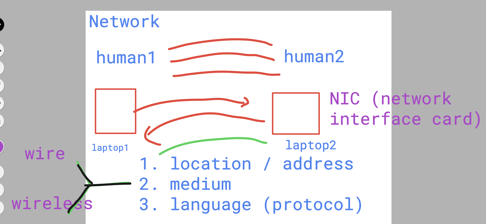
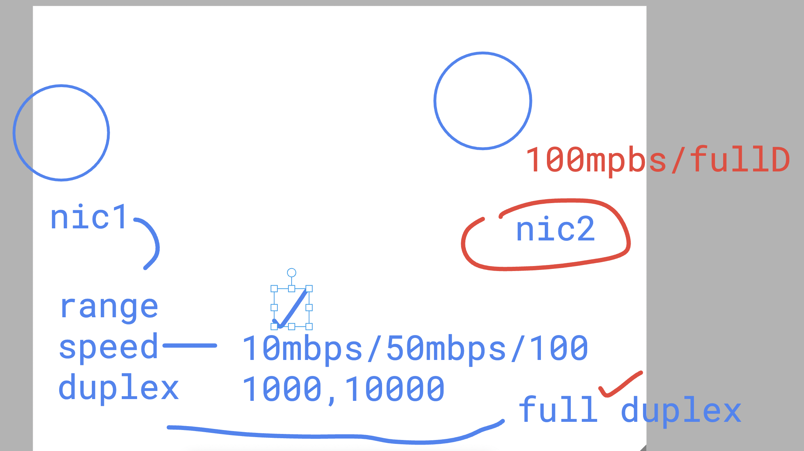
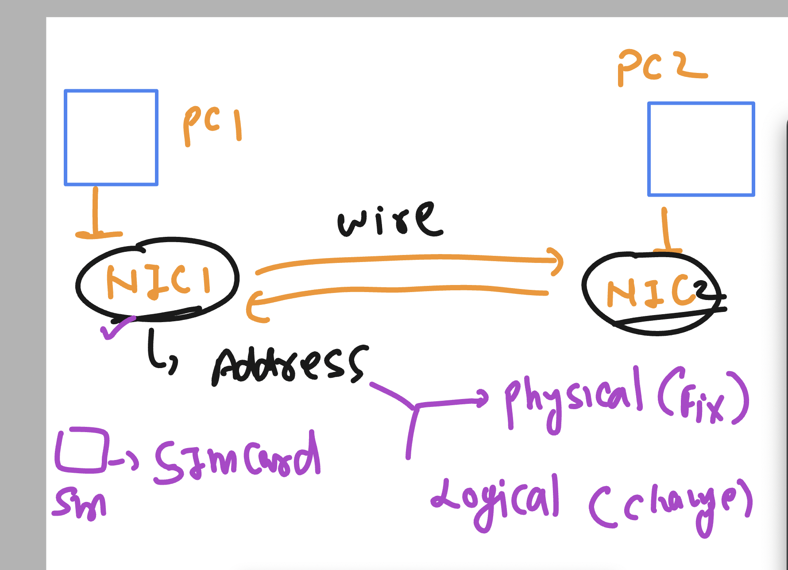
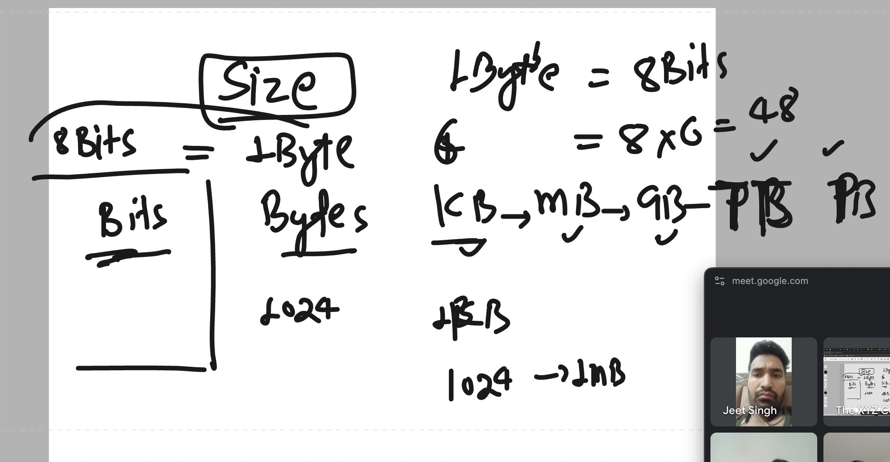
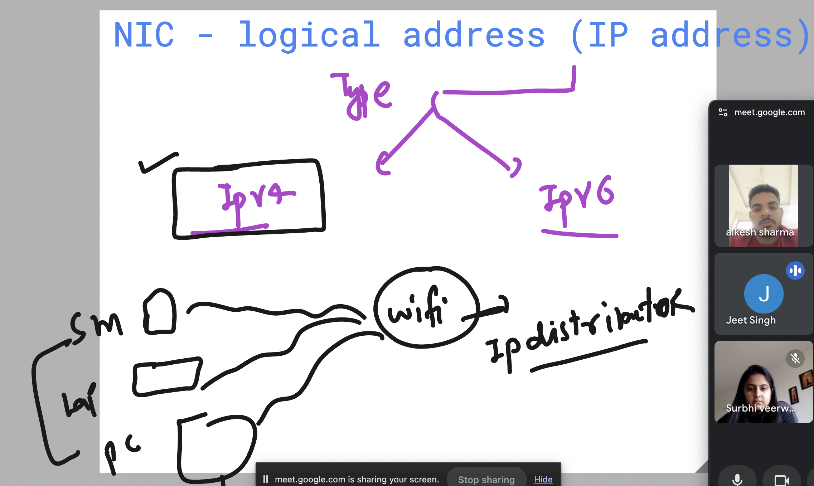
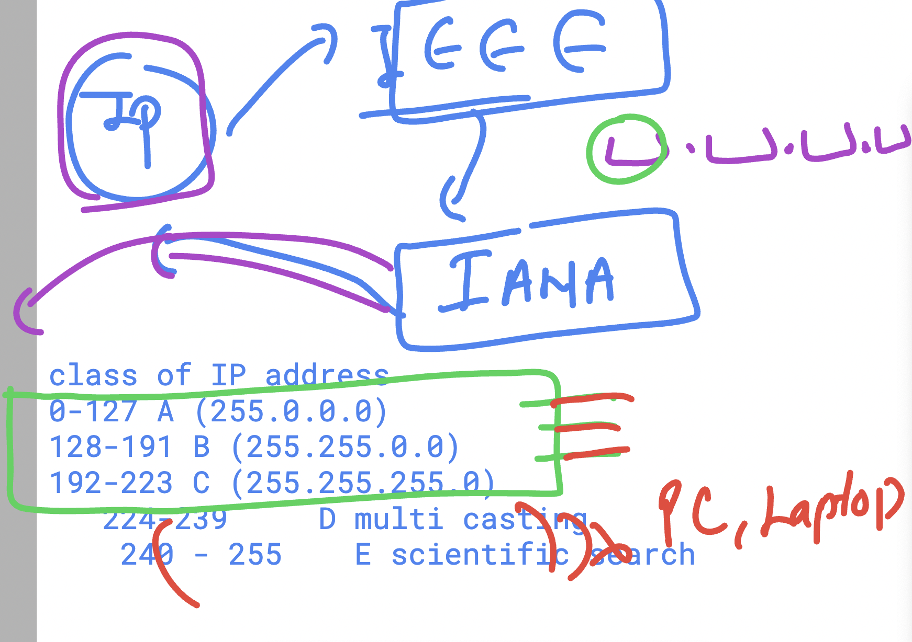

## Things to Notice in Computer system communication 

### Info about NIC (Network interface card)

## NIC -- address concept

## MAC address and normal size concept 

### about IP address 

## Classes of IP address 

