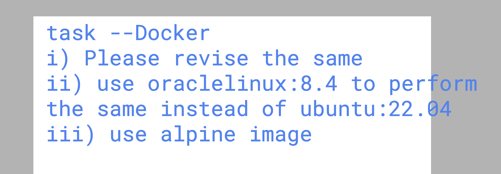

## Docker task 1  as per class 7 



### Task 2 

```
FROM oraclelinux:8.4 
# pulling image fromd docker hub 
LABEL name="ashutoshh"
LABEL email="ashutoshh@linux.com"

RUN  dnf install httpd -y 
# to run any command inside from image container 
COPY ashu.html /var/www/html/index.html 

# setting default process to start httpd service inside image container 
CMD ["/usr/sbin/httpd", "-DFOREGROUND"]
# systemctl start httpd  -->  /usr/sbin/httpd -DFOREGROUND

# CMD will not run during docker image build process but it will be set as default process of image
# default process will run automatically the moment someone create container from this image

```

### Replace oraclelinux:8.4 with ubuntu:22.04  and complete given below
- build image
- create container and verify the page 