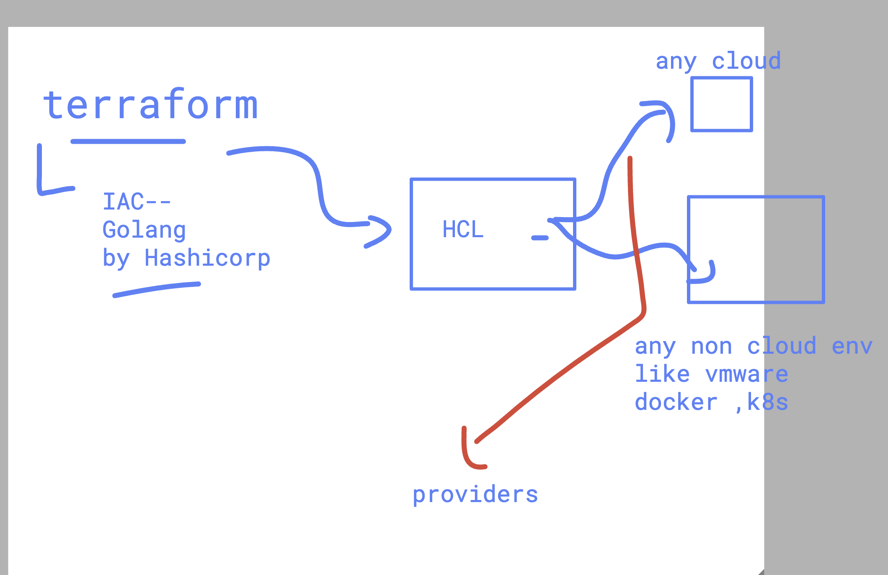
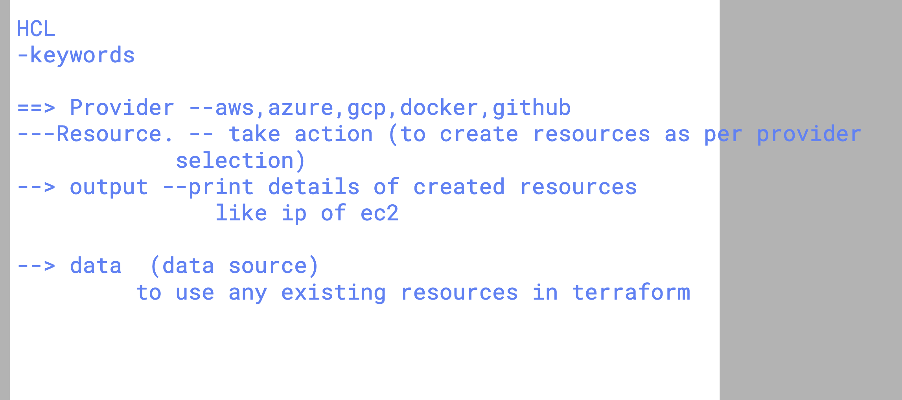
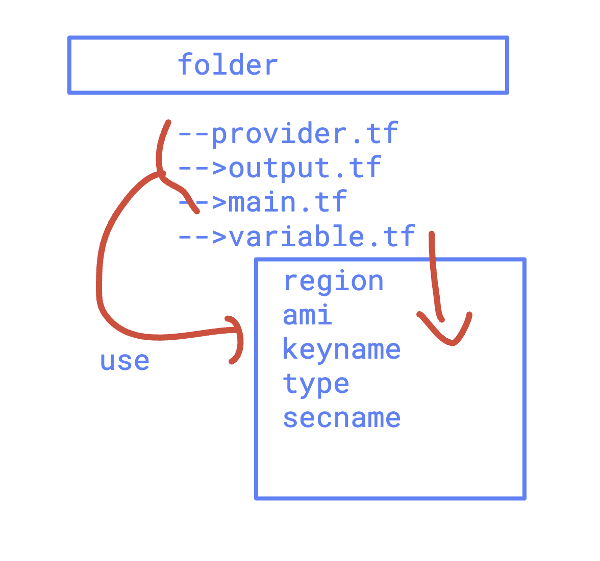
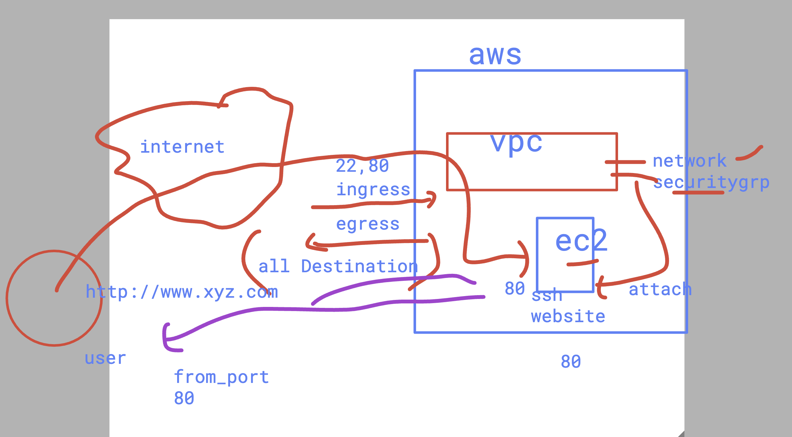

### terraform commands 

```
terraform init
terraform plan
terraform apply
OR ==
terraform apply  --auto-approve
terraform destroy
```

## to setup aws access & secret key in your terraform machine 

```
aws  configure
AWS Access Key ID [****************JVFG]: 
AWS Secret Access Key [****************uBbE]: 
Default region name [ap-southeast-2]: 
Default output format [None]: 

```

## how to check current state of terraform 

```
 humanfirmware@darwin  ~/Devops_targetJuly2025/terraform/aws/ec2   master ±  terraform state list
aws_instance.example
 humanfirmware@darwin  ~/Devops_targetJuly2025/terraform/aws/ec2   master ±  


```
## take code of HCL from given link /website

[click](https://registry.terraform.io/)


### Revision 

## Terraform basic info 



### Understanding HCL keywords 




## final terraform code structure will look like 




### aws with vpc + ec2 + secuirty group understanding 



### Understanding variables and tfvars file 

```
10336  ls
10337  terraform init 
10338  terraform plan 
10339  terraform apply
10340  terraform output
10341  terraform destroy --auto-approve 
10342  terraform plan 
10343  ls
10344  terraform plan --help
10345  terraform plan -var-file=ashu.tfvars
10346  terraform apply  -var-file=ashu.tfvars

```