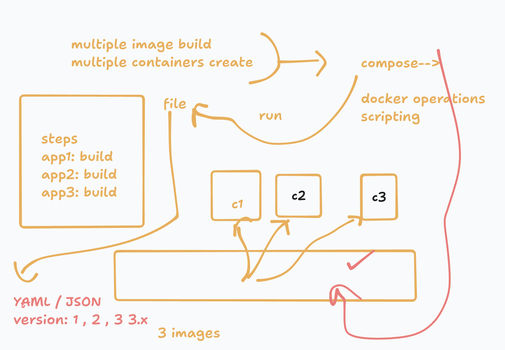

### info about docker compsoe 




```
version: '3.8' 
services:
  dabeliapp:
    image: ashu-dabeli:version1  # image i want to build 
    build: # location and name of dockerfile 
     context: ./dabeli  # location of dockerfile 
     dockerfile: Dockerfile  # name of dockerfile 
    container_name: ashu-dabeli-c1
  panipuriweb:
    image: ashu-panipuri:version1  # image i want to build 
    build: # location and name of dockerfile 
     context: ./panipuri # location of dockerfile 
     dockerfile: Dockerfile  # name of dockerfile 
    container_name: ashu-panipuri-c1

```

### running compose file 

```
buntu@ip-172-31-84-12:~$ docker-compose up -d 
Creating network "ubuntu_default" with the default driver
Building dabeliapp
[+] Building 0.3s (7/7) FINISHED                                                                                                               docker:default
 => [internal] load build definition from Dockerfile                                                                                                     0.0s
 => => transferring dockerfile: 88B                                                                                                                      0.0s
 => WARN: ConsistentInstructionCasing: Command 'copy' should match the case of the command majority (uppercase) (line 2)                                 0.0s
 => [internal] load metadata for docker.io/library/nginx:latest                                                                                          0.1s
 => [internal] load .dockerignore              

 ```
 ### verify 

 ```
ubuntu@ip-172-31-84-12:~$ docker-compose images
   Container        Repository       Tag        Image Id       Size  
---------------------------------------------------------------------
ashu-dabeli-c1     ashu-dabeli     version1   28e1c690681c   192.5 MB
ashu-panipuri-c1   ashu-panipuri   version1   7a2d833671a8   192.5 MB


====>
ubuntu@ip-172-31-84-12:~$ docker-compose ps
      Name                    Command               State   Ports 
------------------------------------------------------------------
ashu-dabeli-c1     /docker-entrypoint.sh ngin ...   Up      80/tcp
ashu-panipuri-c1   /docker-entrypoint.sh ngin ...   Up      80/tcp
 ```

### more compose commands 

```
ubuntu@ip-172-31-84-12:~$ docker-compose ps
      Name                    Command               State   Ports 
------------------------------------------------------------------
ashu-dabeli-c1     /docker-entrypoint.sh ngin ...   Up      80/tcp
ashu-panipuri-c1   /docker-entrypoint.sh ngin ...   Up      80/tcp
ubuntu@ip-172-31-84-12:~$ 
ubuntu@ip-172-31-84-12:~$ docker-compose up -d
ashu-dabeli-c1 is up-to-date
ashu-panipuri-c1 is up-to-date
ubuntu@ip-172-31-84-12:~$ docker-compose images
   Container        Repository       Tag        Image Id       Size  
---------------------------------------------------------------------
ashu-dabeli-c1     ashu-dabeli     version1   28e1c690681c   192.5 MB
ashu-panipuri-c1   ashu-panipuri   version1   7a2d833671a8   192.5 MB
ubuntu@ip-172-31-84-12:~$ docker-compose ps
      Name                    Command               State   Ports 
------------------------------------------------------------------
ashu-dabeli-c1     /docker-entrypoint.sh ngin ...   Up      80/tcp
ashu-panipuri-c1   /docker-entrypoint.sh ngin ...   Up      80/tcp
ubuntu@ip-172-31-84-12:~$ docker-compose down 
Stopping ashu-panipuri-c1 ... done
Stopping ashu-dabeli-c1   ... done
Removing ashu-panipuri-c1 ... done
Removing ashu-dabeli-c1   ... done
Removing network ubuntu_default
ubuntu@ip-172-31-84-12:~$ docker-compose images
Container   Repository   Tag   Image Id   Size
----------------------------------------------
ubuntu@ip-172-31-84-12:~$ docker images
REPOSITORY            TAG        IMAGE ID       CREATED        SIZE
ashu-dabeli           version1   28e1c690681c   25 hours ago   192MB
dabeli                v1         28e1c690681c   25 hours ago   192MB
ashu-panipuri         version1   7a2d833671a8   25 hours ago   192MB
panipuri              v1         7a2d833671a8   25 hours ago   192MB
guacamole/guacd       latest     ee24f45a6ea0   2 days ago     241MB
guacamole/guacamole   latest     90ffe0ecf916   2 days ago     511MB

```

### compose example 2

```
version: '3.8' 
services:
  dabeliapp:
    image: ashu-dabeli:version1  # image i want to build 
    build: # location and name of dockerfile 
     context: ./dabeli  # location of dockerfile 
     dockerfile: Dockerfile  # name of dockerfile 
    container_name: ashu-dabeli-c1
    ports:
      - 1234:80 
  panipuriweb:
    image: ashu-panipuri:version1  # image i want to build 
    build: # location and name of dockerfile 
     context: ./panipuri # location of dockerfile 
     dockerfile: Dockerfile  # name of dockerfile 
    container_name: ashu-panipuri-c1
    ports:
      - 1235:80 

```

### compsoe commands

```
ubuntu@ip-172-31-84-12:/$ docker-compose  ps
ERROR: 
        Can't find a suitable configuration file in this directory or any
        parent. Are you in the right directory?

        Supported filenames: docker-compose.yml, docker-compose.yaml, compose.yml, compose.yaml
        
ubuntu@ip-172-31-84-12:/$ cd
ubuntu@ip-172-31-84-12:~$ 
ubuntu@ip-172-31-84-12:~$ ls
compose.yaml  dabeli  panipuri
ubuntu@ip-172-31-84-12:~$ docker-compose  ps
      Name                    Command               State                  Ports                
------------------------------------------------------------------------------------------------
ashu-dabeli-c1     /docker-entrypoint.sh ngin ...   Up      0.0.0.0:1234->80/tcp,:::1234->80/tcp
ashu-panipuri-c1   /docker-entrypoint.sh ngin ...   Up      0.0.0.0:1235->80/tcp,:::1235->80/tcp
ubuntu@ip-172-31-84-12:~$ docker-compose  stop 
Stopping ashu-dabeli-c1   ... done
Stopping ashu-panipuri-c1 ... done
ubuntu@ip-172-31-84-12:~$ docker-compose  ps
      Name                    Command               State    Ports
------------------------------------------------------------------
ashu-dabeli-c1     /docker-entrypoint.sh ngin ...   Exit 0        
ashu-panipuri-c1   /docker-entrypoint.sh ngin ...   Exit 0        
ubuntu@ip-172-31-84-12:~$ docker-compose  start
Starting dabeliapp   ... done
Starting panipuriweb ... done
ubuntu@ip-172-31-84-12:~$ docker-compose  ps
      Name                    Command               State                  Ports                
------------------------------------------------------------------------------------------------
ashu-dabeli-c1     /docker-entrypoint.sh ngin ...   Up      0.0.0.0:1234->80/tcp,:::1234->80/tcp
ashu-panipuri-c1   /docker-entrypoint.sh ngin ...   Up      0.0.0.0:1235->80/tcp,:::1235->80/tcp
ubuntu@ip-172-31-84-12:~$ 

```

### to rebuild image 

```
docker-compose up -d --build 
```
## Docker networking 

### default info 


### docker bridge and default DHCP 


### by default all containers will get ip from bridge of docker 

```
ubuntu@ip-172-31-84-12:~$ docker  network  ls
NETWORK ID     NAME      DRIVER    SCOPE
2e93c9b61839   bridge    bridge    local
8a2c89b4c94c   host      host      local
8c50e1f73f94   none      null      local
ubuntu@ip-172-31-84-12:~$ docker  ps
CONTAINER ID   IMAGE                 COMMAND                  CREATED        STATUS                  PORTS                                     NAMES
233148799c65   guacamole/guacamole   "/opt/guacamole/bin/…"   23 hours ago   Up 23 hours             0.0.0.0:81->8080/tcp, [::]:81->8080/tcp   guacamole-client
fe94b3a70cff   guacamole/guacd       "/bin/sh -c '/opt/gu…"   24 hours ago   Up 24 hours (healthy)   4822/tcp                                  guacamole-server
cc64980f4513   mysql/mysql-server    "/entrypoint.sh mysq…"   24 hours ago   Up 24 hours (healthy)   3306/tcp, 33060-33061/tcp                 guacamoledb
ubuntu@ip-172-31-84-12:~$ 
ubuntu@ip-172-31-84-12:~$ 
ubuntu@ip-172-31-84-12:~$ 
ubuntu@ip-172-31-84-12:~$ docker  network inspect   bridge 
[
    {
        "Name": "bridge",
        "Id": "2e93c9b61839610e776b15b35e0c03e4743c46f39dd918bd65d225181217ef36",
        "Created": "2025-06-07T04:56:06.022767585Z",
        "Scope": "local",
        "Driver": "bridge",
        "EnableIPv4": true,
        "EnableIPv6": false,
        "IPAM": {
            "Driver": "default",
            "Options": null,
            "Config": [
                {
                    "Subnet": "172.17.0.0/16",
                    "Gateway": "172.17.0.1"
                }
            ]
        },
        "Internal": false,
        "Attachable": false,
        "Ingress": false,
        "ConfigFrom": {
            "Network": ""
        },
        "ConfigOnly": false,
        "Containers": {
            "233148799c6524ad0e926bc57791abec7030c25abd6bc60f8a8f5df000dca456": {
                "Name": "guacamole-client",
                "EndpointID": "5cc66f96ca9c4c3b1236945c25fcef7f0dd80087ee81db4af560fb691a35529a",
                "MacAddress": "b6:24:58:a2:1d:2b",
                "IPv4Address": "172.17.0.4/16",
                "IPv6Address": ""
            },
            "cc64980f451337e90405d8ad127d7a5771a4e882d9924be33105498a922f90da": {
                "Name": "guacamoledb",
                "EndpointID": "69f7407562d60e439a28339b1ef581efb45c30ef11037bd240b7404e049bece4",
                "MacAddress": "96:a3:44:90:00:99",
                "IPv4Address": "172.17.0.2/16",
                "IPv6Address": ""
            },
            "fe94b3a70cffe15bc3a4dc867e8c61dbf75ab0515ae6584ae13256989f0505c3": {
                "Name": "guacamole-server",
                "EndpointID": "16e7a4c51f014412ef8b628e06f6c87ffd34bd381c26338d228825867b23ed41",
                "MacAddress": "ae:d9:e2:5f:7b:7a",
                "IPv4Address": "172.17.0.3/16",
                "IPv6Address": ""

```

## docker image push to docker hub 

```
@redashu ➜ /workspaces/mywebapp-docker (master) $ docker   tag   ashu-image:appv2   docker.io/dockerashu/panipurimage:v1 
@redashu ➜ /workspaces/mywebapp-docker (master) $ 
@redashu ➜ /workspaces/mywebapp-docker (master) $ docker  login   -u dockerashu
Password: 
WARNING! Your password will be stored unencrypted in /home/codespace/.docker/config.json.
Configure a credential helper to remove this warning. See
https://docs.docker.com/engine/reference/commandline/login/#credential-stores

Login Succeeded
@redashu ➜ /workspaces/mywebapp-docker (master) $ docker push docker.io/dockerashu/panipurimage:v1  
The push refers to repository [docker.io/dockerashu/panipurimage]
2e9d13d3d435: Pushed 
941dd9dd8ee4: Mounted from library/nginx 
f6e33ee35fd0: Mounted from library/nginx 
9fd8b974f616: Mounted from library/nginx 
a8b606cdf152: Mounted from library/nginx 
cb857378ec55: Mounted from library/nginx 
deb7d8874f38: Mounted from library/nginx 
ace34d1d784c: Mounted from library/nginx 

```

### any one in this world can pull image now 

```
docker pull docker.io/dockerashu/panipurimage:v1

```

### 

docker pull  dockerashu/panipurimage:v1

## final images


