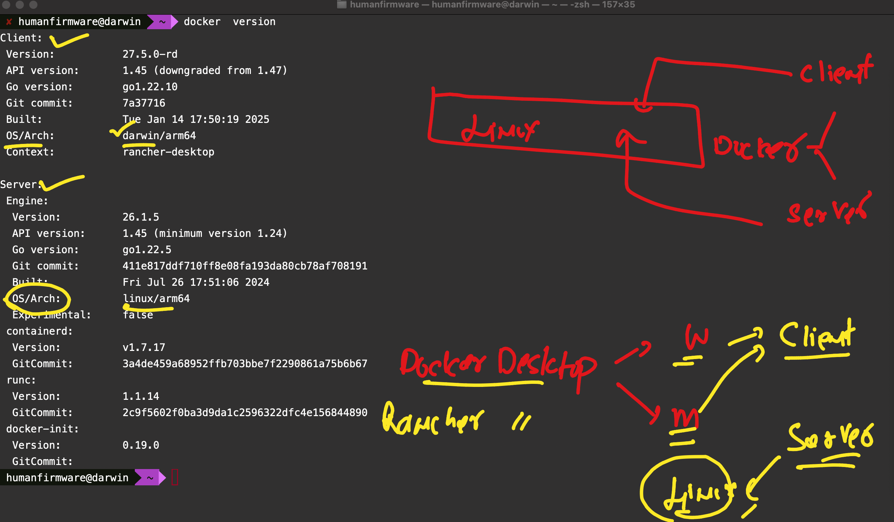
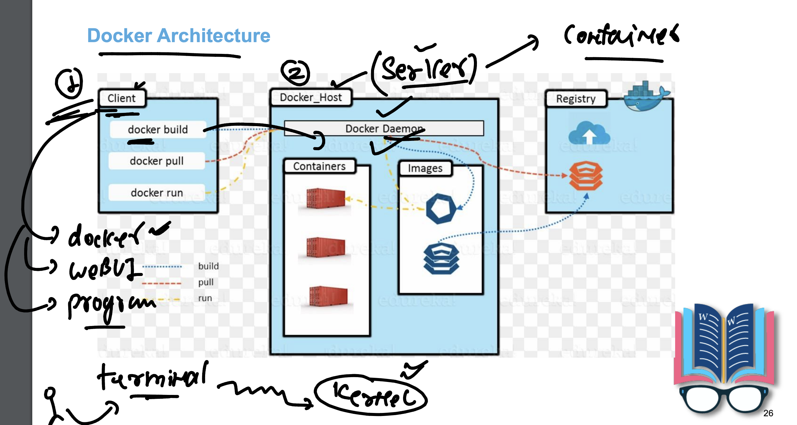
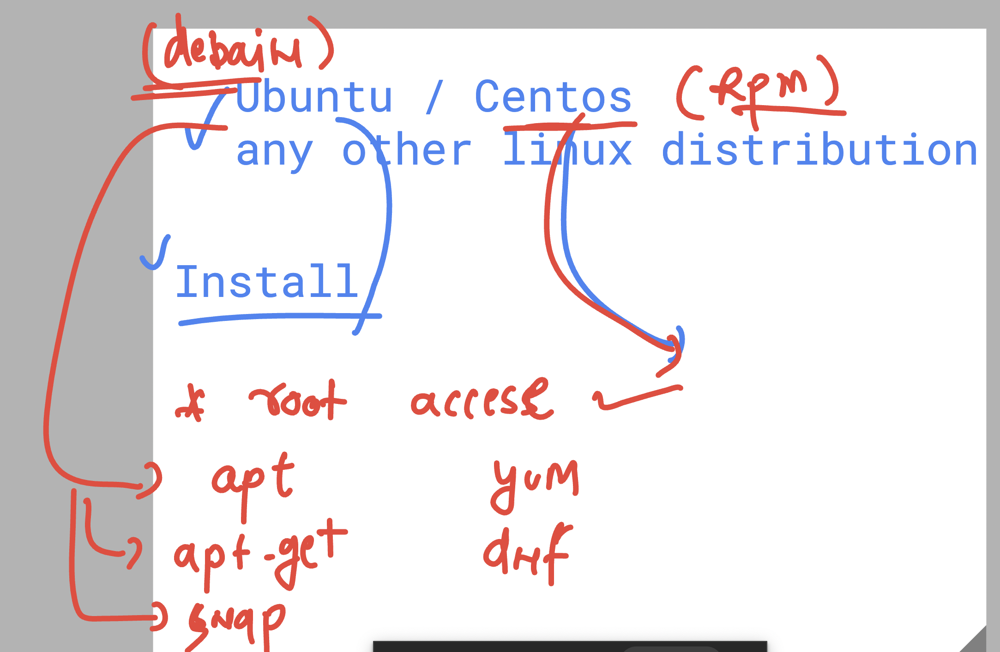
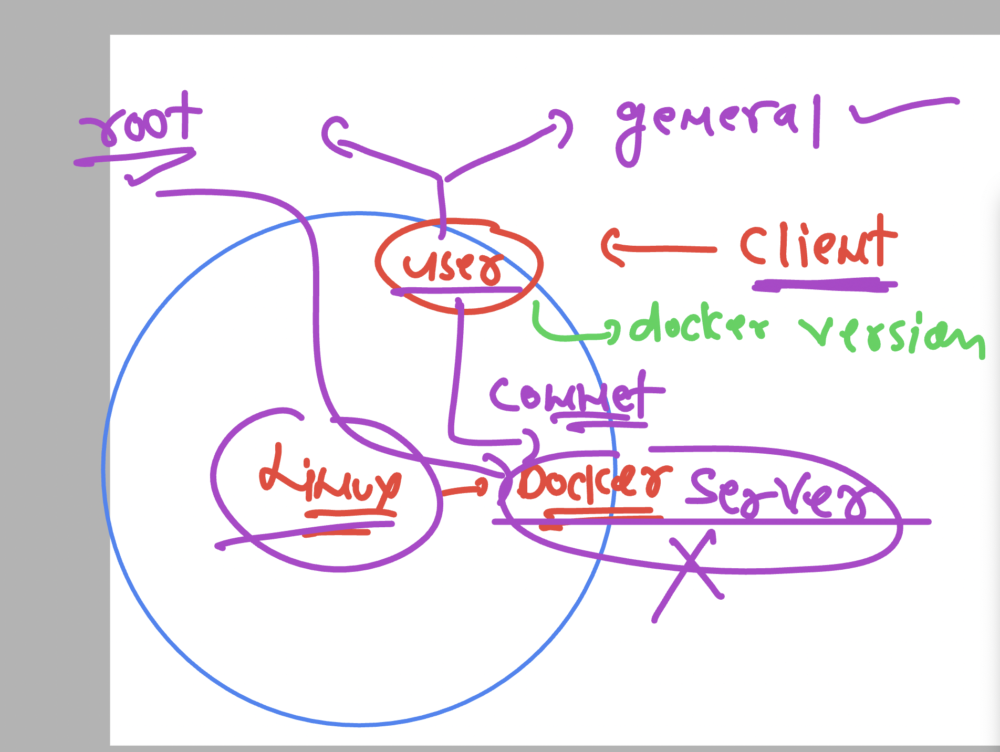

## Docker client and server 



### Docker architecture 



### Docker installation on various linux platform 

[click_here](https://docs.docker.com/engine/install/)

## Installing any software in any linux distro 




## Installing docker on centos machine 

### Step 1 

```
sudo dnf remove docker \
                  docker-client \
                  docker-client-latest \
                  docker-common \
                  docker-latest \
                  docker-latest-logrotate \
                  docker-logrotate \
                  docker-engine
```

### step 2 

```
sudo dnf -y install dnf-plugins-core
sudo dnf config-manager --add-repo https://download.docker.com/linux/centos/docker-ce.repo
```

### step 3 

```
sudo dnf install docker-ce docker-ce-cli containerd.io docker-buildx-plugin docker-compose-plugin
```

## starting docker daemon service 

```
[learntechbyme@devops-class ~]$ sudo systemctl start docker 

[learntechbyme@devops-class ~]$ sudo systemctl status docker 
● docker.service - Docker Application Container Engine
     Loaded: loaded (/usr/lib/systemd/system/docker.service; disabled; preset: disabled)
     Active: active (running) since Mon 2025-04-14 06:10:39 UTC; 5s ago
TriggeredBy: ● docker.socket
       Docs: https://docs.docker.com
   Main PID: 77001 (dockerd)
      Tasks: 8
     Memory: 21.7M
        CPU: 194ms
     CGroup: /system.slice/docker.service

>>> More info about systemctl command 

  11  sudo systemctl start docker 
   12  sudo systemctl status docker 
   13  docker  version 
   14  whoami 
   15  date
   16  sudo date
   17  sudo -i
   18  sudo systemctl status docker 
   19  sudo systemctl stop  docker 
   20  sudo systemctl status docker 
   21  history 
   22  sudo systemctl start docker 
   23  sudo systemctl status docker 
   24  history 
[learntechbyme@devops-class ~]$ sudo systemctl enable  docker 
Created symlink /etc/systemd/system/multi-user.target.wants/docker.service → /usr/lib/systemd/system/docker.service.
[learntechbyme@devops-class ~]$ 
[learntechbyme@devops-class ~]$ sudo systemctl disable  docker 
Removed "/etc/systemd/system/multi-user.target.wants/docker.service".
[learntechbyme@devops-class ~]$ 
[learntechbyme@devops-class ~]$ sudo systemctl enable   docker 
Created symlink /etc/systemd/system/multi-user.target.wants/docker.service → /usr/lib/systemd/system/docker.service.
[learntechbyme@devops-class ~]$ 


```

### Docker client and server permission with linux users 



### Giving docker access to a non root user 

```
sudo usermod  -aG docker learntechbyme 

```

### Dealing with docker user permission 

```
 30  sudo docker version 
   31  sudo -i
   32  ls   -l  /etc/passwd
   33  ls  -ld /etc/
   34  docker  version 
   35  ls  -l  /var/run/docker.sock
   36  whoami 
   37  sudo chmod o+r  /var/run/docker.sock
   38  ls  -l  /var/run/docker.sock
   39  docker version 
   40  sudo chmod o+rw  /var/run/docker.sock
   41  ls  -l  /var/run/docker.sock
   42  docker version 
   43  sudo chmod o-rw  /var/run/docker.sock
   44  ls  -l  /var/run/docker.sock
   45  docker version 
   46  whoami 
   47  sudo usermod  -aG docker learntechbyme 
   48  docker version 
   49  whoami 
   50  docker version 
   51  ls  -l /var/run/docker.sock 
   52  cat /etc/group 

```


