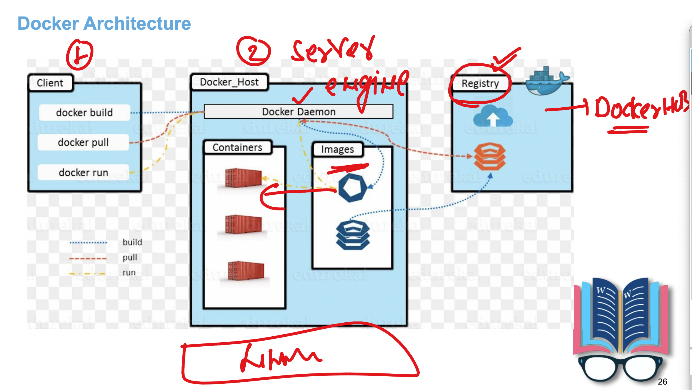
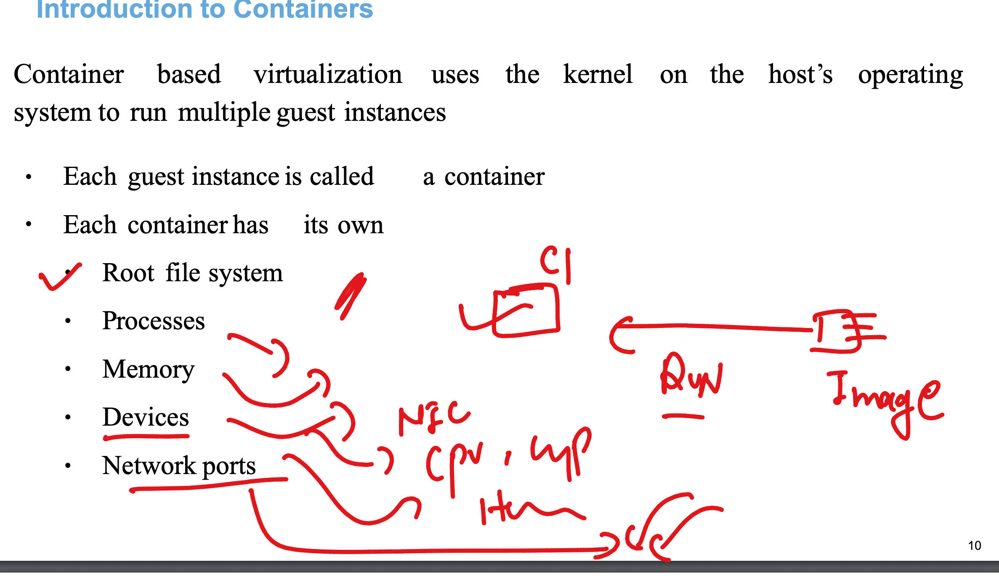
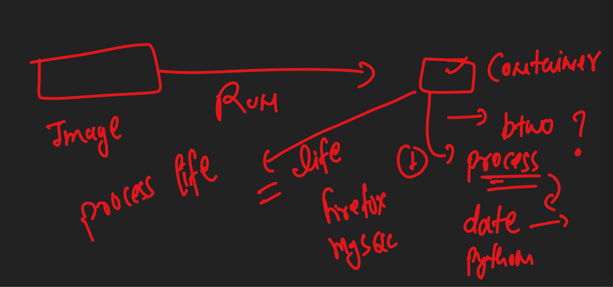

### by default only root user can access docker server from docker client 

- if you want to add access to non root user then add them in docker group 

```
learntechbyme@devops-class ~]$ ls  /home/
delvexdrive  learntechbyme  t1
[learntechbyme@devops-class ~]$ 
[learntechbyme@devops-class ~]$ 
[learntechbyme@devops-class ~]$ sudo -i
[root@devops-class ~]# su - t1
Last login: Mon Apr 14 06:13:48 UTC 2025 on pts/0
[t1@devops-class ~]$ 
[t1@devops-class ~]$ docker  version 
Client: Docker Engine - Community
 Version:           28.0.4
 API version:       1.48
 Go version:        go1.23.7
 Git commit:        b8034c0
 Built:             Tue Mar 25 15:08:34 2025
 OS/Arch:           linux/amd64
 Context:           default
permission denied while trying to connect to the Docker daemon socket at unix:///var/run/docker.sock: Get "http://%2Fvar%2Frun%2Fdocker.sock/v1.48/version": dial unix /var/run/docker.sock: connect: permission denied
[t1@devops-class ~]$ grep docker  /etc/group
docker:x:995:learntechbyme
[t1@devops-class ~]$ 
logout
[root@devops-class ~]# 

```

## Docker architecture and image registry 




### list of image registry from where you can download docker images

- docker hub 
- quay.io 

## Running docker commands from docker client user 

### list of images stored in docker server / daemon /host 

```

[learntechbyme@devops-class ~]$ docker  images
REPOSITORY   TAG       IMAGE ID   CREATED   SIZE
[learntechbyme@devops-class ~]$ 

```

### pulling docker image from docker hub 

```
[learntechbyme@devops-class ~]$ docker  images
REPOSITORY   TAG       IMAGE ID   CREATED   SIZE
[learntechbyme@devops-class ~]$ docker  pull python 
Using default tag: latest
latest: Pulling from library/python
23b7d26ef1d2: Pull complete 
07d1b5af933d: Pull complete 
1eb98adba0eb: Pull complete 
b617a119f8a2: Pull complete 
171e1bee1949: Pull complete 
e25cca11fd29: Pull complete 
739b86d2a778: Pull complete 
Digest: sha256:34dc8eb488136014caf530ec03a3a2403473a92d67a01a26256c365b5b2fc0d4
Status: Downloaded newer image for python:latest
docker.io/library/python:latest
[learntechbyme@devops-class ~]$ 
[learntechbyme@devops-class ~]$ docker  images
REPOSITORY   TAG       IMAGE ID       CREATED       SIZE
python       latest    f285e872b452   12 days ago   1.02GB
[learntechbyme@devops-class ~]$ 

```

### more pull operation 

```
[learntechbyme@devops-class ~]$ docker  pull  ubuntu 
Using default tag: latest
latest: Pulling from library/ubuntu
2726e237d1a3: Pull complete 
Digest: sha256:1e622c5f073b4f6bfad6632f2616c7f59ef256e96fe78bf6a595d1dc4376ac02
Status: Downloaded newer image for ubuntu:latest
docker.io/library/ubuntu:latest
[learntechbyme@devops-class ~]$ docker  images
REPOSITORY   TAG       IMAGE ID       CREATED       SIZE
python       latest    f285e872b452   12 days ago   1.02GB
ubuntu       latest    602eb6fb314b   12 days ago   78.1MB
[learntechbyme@devops-class ~]$ docker  pull  alpine 
Using default tag: latest
latest: Pulling from library/alpine
f18232174bc9: Pull complete 
Digest: sha256:a8560b36e8b8210634f77d9f7f9efd7ffa463e380b75e2e74aff4511df3ef88c
Status: Downloaded newer image for alpine:latest
docker.io/library/alpine:latest
[learntechbyme@devops-class ~]$ docker  images
REPOSITORY   TAG       IMAGE ID       CREATED        SIZE
python       latest    f285e872b452   12 days ago    1.02GB
ubuntu       latest    602eb6fb314b   12 days ago    78.1MB
alpine       latest    aded1e1a5b37   2 months ago   7.83MB
[learntechbyme@devops-class ~]$ 
[learntechbyme@devops-class ~]$ docker  pull  mysql
Using default tag: latest
latest: Pulling from library/mysql
cea172a6e83b: Pull complete 
fa811e9a869e: Pull complete 
47a2982daa21: Pull complete 
634d7076afe3: Pull complete 
aa8a3958f09f: Pull complete 
84e4e5ea3754: Pull complete 
2275c0ff11a0: Pull complete 
2792ea2d4e0e: Pull complete 
f488b2cd8494: Pull complete 
9451290759df: Pull complete 
Digest: sha256:7839322bd6c3174a699586c3ea36314c59b61b4ce01b4146951818b94aef5fd7
Status: Downloaded newer image for mysql:latest
docker.io/library/mysql:latest
[learntechbyme@devops-class ~]$ docker  images
REPOSITORY   TAG       IMAGE ID       CREATED        SIZE
mysql        latest    4b2d796bebc2   6 days ago     859MB
python       latest    f285e872b452   12 days ago    1.02GB
ubuntu       latest    602eb6fb314b   12 days ago    78.1MB
alpine       latest    aded1e1a5b37   2 months ago   7.83MB
[learntechbyme@devops-class ~]$ 

===>>

[learntechbyme@devops-class ~]$ docker  pull  ubuntu:20.04 
20.04: Pulling from library/ubuntu
13b7e930469f: Pull complete 
Digest: sha256:8feb4d8ca5354def3d8fce243717141ce31e2c428701f6682bd2fafe15388214
Status: Downloaded newer image for ubuntu:20.04
docker.io/library/ubuntu:20.04
[learntechbyme@devops-class ~]$ docker  images
REPOSITORY   TAG       IMAGE ID       CREATED        SIZE
mysql        latest    4b2d796bebc2   6 days ago     859MB
python       latest    f285e872b452   12 days ago    1.02GB
ubuntu       latest    602eb6fb314b   12 days ago    78.1MB
ubuntu       20.04     b7bab04fd9aa   12 days ago    72.8MB
alpine       latest    aded1e1a5b37   2 months ago   7.83MB
[learntechbyme@devops-class ~]$ 


```

### Removing unused docker images 

```
[learntechbyme@devops-class ~]$ docker  images
REPOSITORY   TAG       IMAGE ID       CREATED        SIZE
mysql        latest    4b2d796bebc2   6 days ago     859MB
python       latest    f285e872b452   12 days ago    1.02GB
ubuntu       latest    602eb6fb314b   12 days ago    78.1MB
ubuntu       20.04     b7bab04fd9aa   12 days ago    72.8MB
alpine       latest    aded1e1a5b37   2 months ago   7.83MB
[learntechbyme@devops-class ~]$ 

[learntechbyme@devops-class ~]$ docker  rmi f285e872b452 
Untagged: python:latest
Untagged: python@sha256:34dc8eb488136014caf530ec03a3a2403473a92d67a01a26256c365b5b2fc0d4
Deleted: sha256:f285e872b4525229679829f02db72786ab1a5022d2ab55d7d67ac3cc0becd790
Deleted: sha256:30ccc0183f0abcc47861496d15556e428bc145c818b46b808c17ba63da1964fd
Deleted: sha256:efec4a6d0f773f909e02389c71158c7aec7ac6e92ab9e8b61f01486a098a3faa
Deleted: sha256:f2edb07c31c10e24333618f0a77aff073d42c0a2246d052a08d07b014183e929
Deleted: sha256:7e5105b4419fada3eebac3937a3b4f1cb73f68bb1a29ad497ca9818f266f7282
Deleted: sha256:d73bb8010e6bf3d9a518d750d1d297b581bd3043795a84822af5e9b8ca5b0194
Deleted: sha256:3a26c244a5d6a26b2a006f304a6b74254d40b0cc6e16626f120c8999f3a5e032
Deleted: sha256:f7f2b929d8a55112a2db1bc16fb8731045c9572b84d6dfbbdbd5dc6dd2bd9fe4
[learntechbyme@devops-class ~]$ docker  images
REPOSITORY   TAG       IMAGE ID       CREATED        SIZE
mysql        latest    4b2d796bebc2   6 days ago     859MB
ubuntu       latest    602eb6fb314b   12 days ago    78.1MB
ubuntu       20.04     b7bab04fd9aa   12 days ago    72.8MB
alpine       latest    aded1e1a5b37   2 months ago   7.83MB

[learntechbyme@devops-class ~]$ docker  rmi mysql:latest 
Untagged: mysql:latest
Untagged: mysql@sha256:7839322bd6c3174a699586c3ea36314c59b61b4ce01b4146951818b94aef5fd7
Deleted: sha256:4b2d796bebc27d70aca324403b4f16bca96eba549b39633c9ba55f2bc37bf85e
Deleted: sha256:a42dc7ff459e8712b86640c1bea3efc7a7408325db6f829347cdaac409991ffe
Deleted: sha256:e15a64b6ae049ced930eef158e8eb50f5ac45335197bfadb4c15c5bdcfd32cd7
Deleted: sha256:cd8de8135a6262c12261ea53b4f5f366846a94f145db9e3ec7f3204108f47e7b
Deleted: sha256:6cdb5dc99a09ccc2e3c9c888ea8617793c4d2e9940419f82043eebdfc20f452c
Deleted: sha256:471335b477e6acdf6fddd553aba257c11185b3bb826f357c2f322e27381a375d
Deleted: sha256:1506af780c490fb8123e86a0cbd5167def2c0ca10d361f1b910ce9eeb63a63dd
Deleted: sha256:93add6bde36994382b8570414521bc5dfcd11c55e22c429dd97b1856b4437260
Deleted: sha256:32ce4c28a6de0b0eaf791afda8243df24e980058a95c96ff73e421a27dd42698
Deleted: sha256:ba125672cc3f45e472fb390495d240f81817ab32141fd84a084cef8305de1ec3
Deleted: sha256:561b565cf5eba84f1729d1d097d529566c1f992937a14ac7ec12e76a4a5693d2

[learntechbyme@devops-class ~]$ docker  images
REPOSITORY   TAG       IMAGE ID       CREATED        SIZE
ubuntu       latest    602eb6fb314b   12 days ago    78.1MB
ubuntu       20.04     b7bab04fd9aa   12 days ago    72.8MB
alpine       latest    aded1e1a5b37   2 months ago   7.83MB

```

### Creating container from docker image 



### container life vs process 



### creating container with linux kernel 

```
learntechbyme@devops-class ~]$ docker  run    -it    alpine 
/ # whoami 
root
/ # ls
bin    dev    etc    home   lib    media  mnt    opt    proc   root   run    sbin   srv    sys    tmp    usr    var
/ # cat  /etc/os-release 
NAME="Alpine Linux"
ID=alpine
VERSION_ID=3.21.3
PRETTY_NAME="Alpine Linux v3.21"
HOME_URL="https://alpinelinux.org/"
BUG_REPORT_URL="https://gitlab.alpinelinux.org/alpine/aports/-/issues"
/ # 
/ # uname 
Linux
/ # uname -r
5.14.0-570.el9.x86_64
/ # exit

====>> 
[learntechbyme@devops-class ~]$ uname 
Linux
[learntechbyme@devops-class ~]$ uname -r
5.14.0-570.el9.x86_64
[learntechbyme@devops-class ~]$ cat  /etc/os-release 
NAME="CentOS Stream"
VERSION="9"
ID="centos"
ID_LIKE="rhel fedora"
VERSION_ID="9"
PLATFORM_ID="platform:el9"
PRETTY_NAME="CentOS Stream 9"
ANSI_COLOR="0;31"
LOGO="fedora-logo-icon"
CPE_NAME="cpe:/o:centos:centos:9"
HOME_URL="https://centos.org/"
BUG_REPORT_URL="https://issues.redhat.com/"
REDHAT_SUPPORT_PRODUCT="Red Hat Enterprise Linux 9"
REDHAT_SUPPORT_PRODUCT_VERSION="CentOS Stream"

```

## docker run operation 

```
[learntechbyme@devops-class ~]$ docker  ps  -a
CONTAINER ID   IMAGE     COMMAND     CREATED         STATUS                          PORTS     NAMES
6082e5836357   alpine    "/bin/sh"   2 minutes ago   Exited (0) About a minute ago             quizzical_buck
4624f59fb234   alpine    "/bin/sh"   9 minutes ago   Exited (0) 9 minutes ago                  romantic_yalow
[learntechbyme@devops-class ~]$ 
[learntechbyme@devops-class ~]$ 
[learntechbyme@devops-class ~]$ docker  run    -it   -d   alpine 
d799fdeee3b59506bd19fd6471494346145e6542fa68a7edecaedf60ea32466d
[learntechbyme@devops-class ~]$ 
[learntechbyme@devops-class ~]$ docker  ps -a
CONTAINER ID   IMAGE     COMMAND     CREATED          STATUS                      PORTS     NAMES
d799fdeee3b5   alpine    "/bin/sh"   4 seconds ago    Up 3 seconds                          trusting_shtern
6082e5836357   alpine    "/bin/sh"   3 minutes ago    Exited (0) 2 minutes ago              quizzical_buck
4624f59fb234   alpine    "/bin/sh"   10 minutes ago   Exited (0) 10 minutes ago             romantic_yalow
[learntechbyme@devops-class ~]$ 
[learntechbyme@devops-class ~]$ \
> ^C
[learntechbyme@devops-class ~]$ 
[learntechbyme@devops-class ~]$ 
[learntechbyme@devops-class ~]$ docker  run    -it   -d  --name  ashuc1  alpine 
662844bdeb7c0dae66be2528a19c08799cbb276be085c57796bfdd5249cec472
[learntechbyme@devops-class ~]$ docker  ps
CONTAINER ID   IMAGE     COMMAND     CREATED          STATUS          PORTS     NAMES
662844bdeb7c   alpine    "/bin/sh"   2 seconds ago    Up 1 second               ashuc1
d799fdeee3b5   alpine    "/bin/sh"   32 seconds ago   Up 31 seconds             trusting_shtern
[learntechbyme@devops-class ~]$ docker  ps -a
CONTAINER ID   IMAGE     COMMAND     CREATED          STATUS                      PORTS     NAMES
662844bdeb7c   alpine    "/bin/sh"   5 seconds ago    Up 4 seconds                          ashuc1
d799fdeee3b5   alpine    "/bin/sh"   35 seconds ago   Up 34 seconds                         trusting_shtern
6082e5836357   alpine    "/bin/sh"   3 minutes ago    Exited (0) 2 minutes ago              quizzical_buck
4624f59fb234   alpine    "/bin/sh"   10 minutes ago   Exited (0) 10 minutes ago             romantic_yalow
[learntechbyme@devops-class ~]$ 

```


