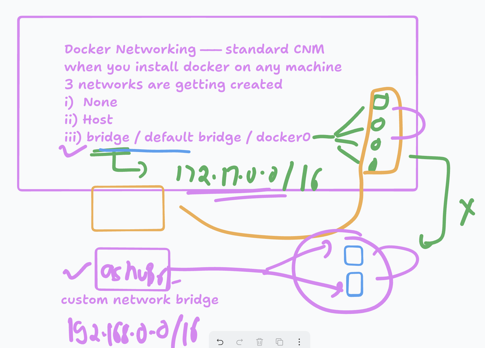

## importance of creating a seperate docker network bridge



### creating bridge

```
@redashu ➜ /workspaces/mywebapp-docker (master) $ docker network ls
NETWORK ID     NAME                      DRIVER    SCOPE
fa694ae2f023   bridge                    bridge    local
8fe5089276d8   host                      host      local
5f7c93248200   mywebapp-docker_default   bridge    local
bab335a88fc8   none                      null      local
@redashu ➜ /workspaces/mywebapp-docker (master) $ 
@redashu ➜ /workspaces/mywebapp-docker (master) $ 
@redashu ➜ /workspaces/mywebapp-docker (master) $ docker network create  ashubr1
98f169c376c096f3208930f8edc3193d4c2105634e7d0cd96c4a374f9c850dc9
@redashu ➜ /workspaces/mywebapp-docker (master) $ docker network ls
NETWORK ID     NAME                      DRIVER    SCOPE
98f169c376c0   ashubr1                   bridge    local
fa694ae2f023   bridge                    bridge    local
8fe5089276d8   host                      host      local
5f7c93248200   mywebapp-docker_default   bridge    local
bab335a88fc8   none                      null      local
@redashu ➜ /workspaces/mywebapp-docker (master) $ 

```

### dealing with db container in docker 

```
@redashu ➜ /workspaces/mywebapp-docker/customer2 (master) $ docker run -itd --name db1  -e  MYSQL_ROOT_PASSWORD=Hello@123 mysql
Unable to find image 'mysql:latest' locally
latest: Pulling from library/mysql
9845df06f911: Pull complete 
4bd1fb59dd90: Pull complete 
d23320eed97a: Pull complete 
7074f55c9a02: Pull complete 
72ac912b8a2e: Pull complete 
b097427f1ebe: Pull complete 

```

### login to db container 

```
@redashu ➜ /workspaces/mywebapp-docker/customer2 (master) $  docker  ps
CONTAINER ID   IMAGE     COMMAND                  CREATED         STATUS         PORTS                 NAMES
6446ff055ba9   mysql     "docker-entrypoint.s…"   3 seconds ago   Up 2 seconds   3306/tcp, 33060/tcp   db1
@redashu ➜ /workspaces/mywebapp-docker/customer2 (master) $ 
@redashu ➜ /workspaces/mywebapp-docker/customer2 (master) $ 
@redashu ➜ /workspaces/mywebapp-docker/customer2 (master) $ 
@redashu ➜ /workspaces/mywebapp-docker/customer2 (master) $ 
@redashu ➜ /workspaces/mywebapp-docker/customer2 (master) $ docker  exec -it  db1  bash 
bash-5.1# 
bash-5.1# 
bash-5.1# mysql -u root -p
Enter password: 
Welcome to the MySQL monitor.  Commands end with ; or \g.
Your MySQL connection id is 9
Server version: 9.3.0 MySQL Community Server - GPL

Copyright (c) 2000, 2025, Oracle and/or its affiliates.

Oracle is a registered trademark of Oracle Corporation and/or its
affiliates. Other names may be trademarks of their respective
owners.

Type 'help;' or '\h' for help. Type '\c' to clear the current input statement.

mysql> show databases;
+--------------------+
| Database           |
+--------------------+
| information_schema |
| mysql              |
| performance_schema |
| sys                |
+--------------------+
4 rows in set (0.004 sec)

mysql> exit;
Bye
bash-5.1# exit
exit

```

## compose file 

```
services:
  ashudb: 
    image:  mysql:latest
    environment:
      MYSQL_ROOT_PASSWORD: hello@123
    container_name: ashudbc1 
  webapp1:
    image: nginx:latest
    build:
      context: webapp1
      dockerfile: Dockerfile1
    ports:
      - "8080:80"
```

### docker volume 

```
@redashu ➜ /workspaces/mywebapp-docker/customer2 (master) $ docker volume  ls
DRIVER    VOLUME NAME
local     36dd24748586e8308a4d05d4471e9e2673818bd0bcb83a939d52888813773fee
local     87ad4a1a7990d9f2b14a09a1532ccc9e3f120e596aa1e6a613af56e5a7fca493
@redashu ➜ /workspaces/mywebapp-docker/customer2 (master) $ 
@redashu ➜ /workspaces/mywebapp-docker/customer2 (master) $ docker volume  create  ashu-vol1
ashu-vol1
@redashu ➜ /workspaces/mywebapp-docker/customer2 (master) $ docker volume  ls
DRIVER    VOLUME NAME
local     36dd24748586e8308a4d05d4471e9e2673818bd0bcb83a939d52888813773fee
local     87ad4a1a7990d9f2b14a09a1532ccc9e3f120e596aa1e6a613af56e5a7fca493
local     ashu-vol1
@redashu ➜ /workspaces/mywebapp-docker/customer2 (master) $ docker run -itd --name x1   -v  ashu-vol1:/tmp/ashu  alpine 
176973892e796f9f925f00793e75fa98e3fa0a4024c9935dc967d293c27b5af0
@redashu ➜ /workspaces/mywebapp-docker/customer2 (master) $ docker exec -it x1 sh 
/ # cd  /tmp/
/tmp # ls
ashu
/tmp # cd ashu/
/tmp/ashu # mkdir hello ashgu
/tmp/ashu # ls
ashgu  hello
/tmp/ashu # exit
@redashu ➜ /workspaces/mywebapp-docker/customer2 (master) $ 
@redashu ➜ /workspaces/mywebapp-docker/customer2 (master) $ 
@redashu ➜ /workspaces/mywebapp-docker/customer2 (master) $ docker rm -f x1
x1
@redashu ➜ /workspaces/mywebapp-docker/customer2 (master) $ 
@redashu ➜ /workspaces/mywebapp-docker/customer2 (master) $ docker volume ls
DRIVER    VOLUME NAME
local     36dd24748586e8308a4d05d4471e9e2673818bd0bcb83a939d52888813773fee
local     87ad4a1a7990d9f2b14a09a1532ccc9e3f120e596aa1e6a613af56e5a7fca493
local     ashu-vol1
@redashu ➜ /workspaces/mywebapp-docker/customer2 (master) $ 
@redashu ➜ /workspaces/mywebapp-docker/customer2 (master) $ docker run -itd --name x1   -v  ashu-vol1:/root/hello   alpine 
dfb5bf0430ef0257227f2bb02a24cef926fd74b0e379b4ac2c36f203dc256e0d
@redashu ➜ /workspaces/mywebapp-docker/customer2 (master) $ 
@redashu ➜ /workspaces/mywebapp-docker/customer2 (master) $ docker exec -it x1 sh 
/ # cd /root/hello/
~/hello # ls
ashgu  hello
~/hello # exit

```


### volume working 

```
@redashu ➜ /workspaces/mywebapp-docker/customer2 (master) $ docker run -itd --name x2 -p 1255:80  -v ./webapp1:/usr/share/nginx/html/   nginx 
51c696cde09cfce6629b626ddbbb6f66ac781da93d31fdf8655f577c0ceb9996
@redashu ➜ /workspaces/mywebapp-docker/customer2 (master) $ 
@redashu ➜ /workspaces/mywebapp-docker/customer2 (master) $ docker  exec -it x2 bash 
root@51c696cde09c:/# cd /usr/share/nginx/html/
root@51c696cde09c:/usr/share/nginx/html# ls
Dockerfile  index.html
root@51c696cde09c:/usr/share/nginx/html# exit
exit

```
### example 

```
volumes: # creating volume 
  ashuvolu1: 
services:
  ashudb: 
    image:  mysql:latest
    environment:
      MYSQL_ROOT_PASSWORD: hello@123
    container_name: ashudbc1 
    volumes: # attaching volume 
      - ashuvolu1:/root/data
  webapp1:
    image: nginx:latest
    build:
      context: webapp1
      dockerfile: Dockerfile1
    ports:
      - "8080:80"
    volumes: # attaching volume 
      - ashuvolu1:/usr/share/nginx/html
   
```
