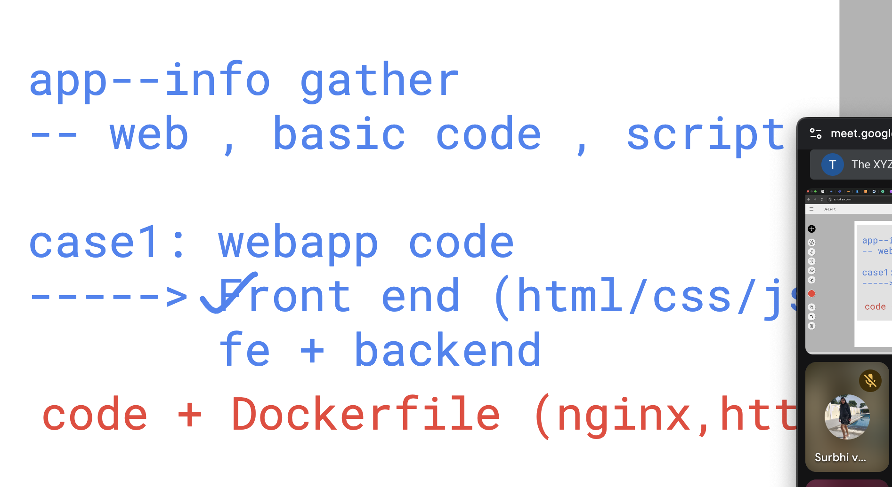
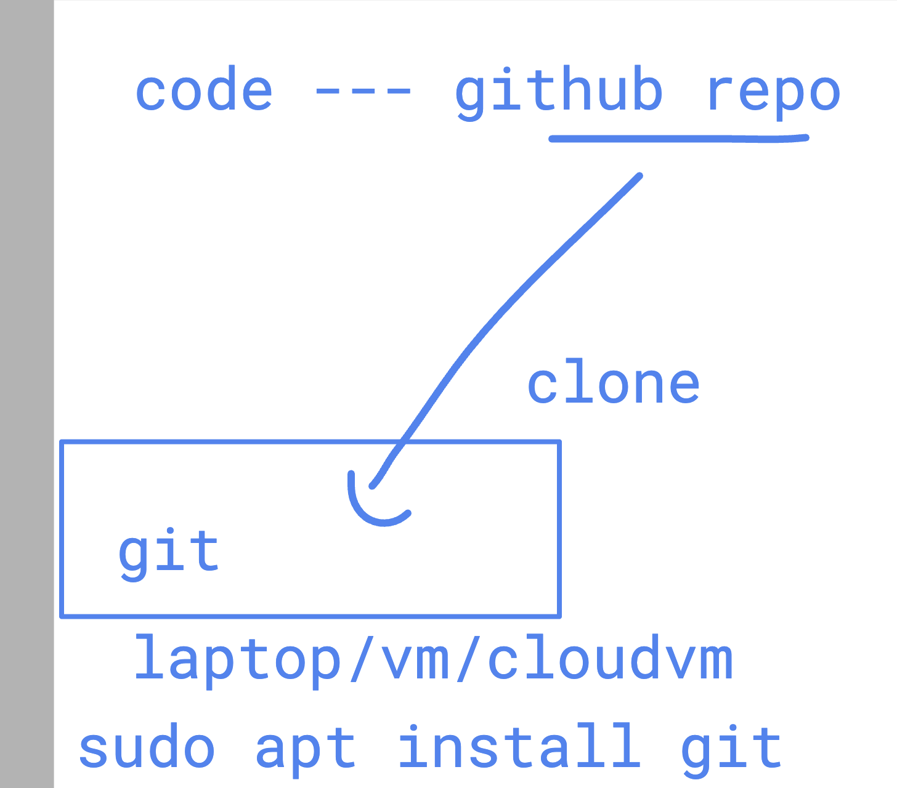
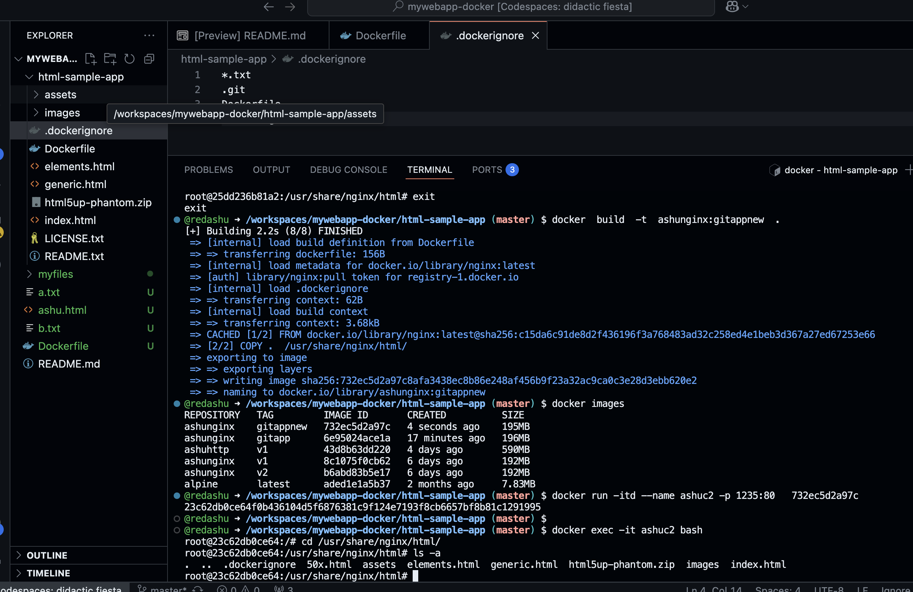

### Understanding web app need for dockerfile 



### we can download a github repo code using 
- git clone <repo-url>



```
@redashu ➜ /workspaces/mywebapp-docker (master) $ git clone https://github.com/schoolofdevops/html-sample-app 
Cloning into 'html-sample-app'...
remote: Enumerating objects: 74, done.
remote: Counting objects: 100% (3/3), done.
remote: Compressing objects: 100% (3/3), done.
remote: Total 74 (delta 0), reused 0 (delta 0), pack-reused 71 (from 1)
Receiving objects: 100% (74/74), 1.38 MiB | 36.25 MiB/s, done.
Resolving deltas: 100% (5/5), done.
@redashu ➜ /workspaces/mywebapp-docker (master) $ ls
Dockerfile  README.md  a.txt  ashu.html  b.txt  html-sample-app  myfiles
@redashu ➜ /workspaces/mywebapp-docker (master) $ 

```

## building image 

```
@redashu ➜ /workspaces/mywebapp-docker (master) $ ls
Dockerfile  README.md  a.txt  ashu.html  b.txt  html-sample-app  myfiles
@redashu ➜ /workspaces/mywebapp-docker (master) $ cd  html-sample-app/
@redashu ➜ /workspaces/mywebapp-docker/html-sample-app (master) $ ls
Dockerfile  LICENSE.txt  README.txt  assets  elements.html  generic.html  html5up-phantom.zip  images  index.html
@redashu ➜ /workspaces/mywebapp-docker/html-sample-app (master) $ 
@redashu ➜ /workspaces/mywebapp-docker/html-sample-app (master) $ docker  build  -t  ashunginx:gitapp  . 
[+] Building 4.1s (8/8) FINISHED                                                                                                        docker:default
 => [internal] load build definition from Dockerfile                                                                                              0.0s
 => => transferring dockerfile: 156B                                                                                                              0.0s
 => [internal] load metadata for docker.io/library/nginx:latest                                                                                   1.6s
 => [auth] library/nginx:pull token for registry-1.docker.io                                                                                      0.0s
 => [internal] load .dockerignore                                                                                                                 0.0s
 => => transferring context: 2B                                                                                                                   0.0s
 => [internal] load build context                                                                                                                 0.1s
 => => transferring context: 3.56MB                                                                                                               0.1s
 => CACHED [1/2] FROM docker.io/library/nginx:latest@sha256:c15da6c91de8d2f436196f3a768483ad32c258ed4e1beb3d367a27ed67253e66                      0.0s
 => [2/2] COPY .  /usr/share/nginx/html/                                                                                                          0.3s
 => exporting to image                                                                                                                            2.0s
 => => exporting layers                                                                                                                           2.0s
 => => writing image sha256:6e95024ace1a702abc09c1449083132fdc3077cf4ee790280d71e64e8e534e3a                                                      0.0s
 => => naming to docker.io/library/ashunginx:gitapp                                                                                               0.0s
@redashu ➜ /workspaces/mywebapp-docker/html-sample-app (master) $ 

```

### creating container 

```
@redashu ➜ /workspaces/mywebapp-docker/html-sample-app (master) $ docker images
REPOSITORY   TAG       IMAGE ID       CREATED         SIZE
ashunginx    gitapp    6e95024ace1a   3 minutes ago   196MB
ashuhttp     v1        43d8b63dd220   4 days ago      590MB
ashunginx    v1        8c1075f0cb62   6 days ago      192MB
ashunginx    v2        b6abd83b5e17   6 days ago      192MB
alpine       latest    aded1e1a5b37   2 months ago    7.83MB
@redashu ➜ /workspaces/mywebapp-docker/html-sample-app (master) $ docker run -itd --name ashuc1 -p 1234:80  6e95024ace1a
25dd236b81a29156996c02f34c1217e47a6707f8d17d938709fc417d6d7f6eed
@redashu ➜ /workspaces/mywebapp-docker/html-sample-app (master) $ docker ps
CONTAINER ID   IMAGE          COMMAND                  CREATED          STATUS          PORTS                                     NAMES
25dd236b81a2   6e95024ace1a   "/docker-entrypoint.…"   44 seconds ago   Up 43 seconds   0.0.0.0:1234->80/tcp, [::]:1234->80/tcp   ashuc1
@redashu ➜ /workspaces/mywebapp-docker/html-sample-app (master) $ 

```

### understading .dockerignore usage




