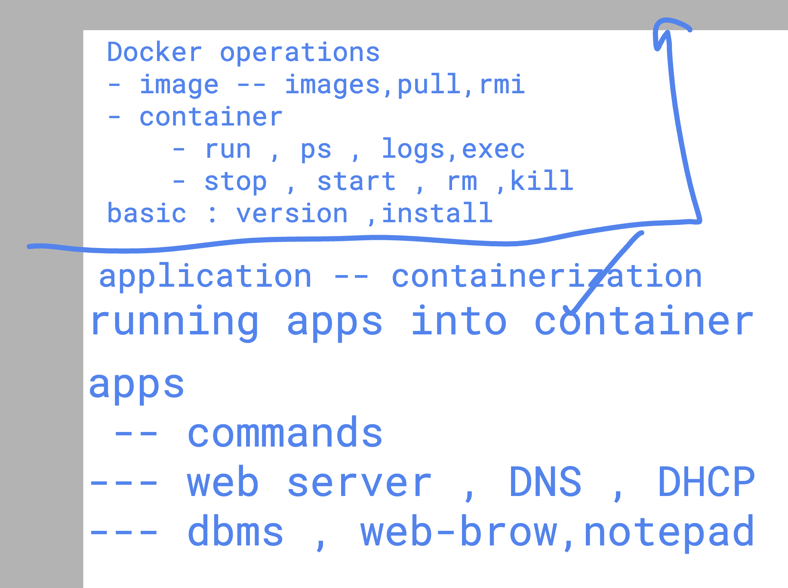
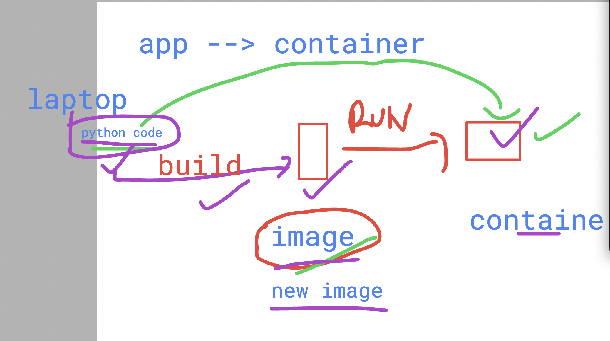
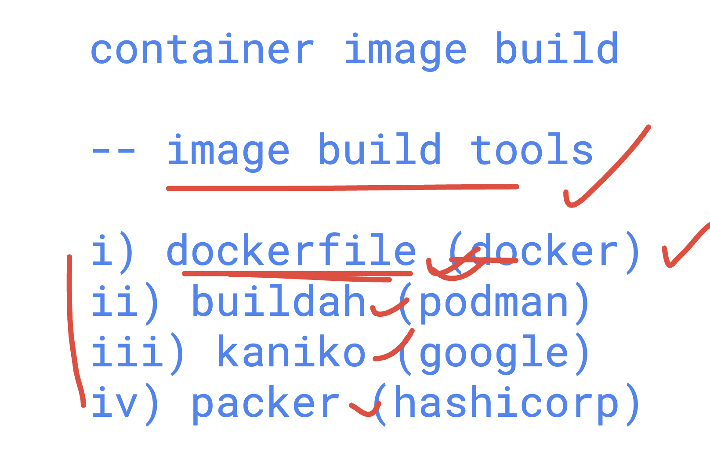

# Checking Few Details About Docker Containers 

## Few Checks

```bash
$ uname
Linux
$ uname -r
5.14.0-570.el9.x86_64
$ whoami
learntechbyme
$ docker version
Client: Docker Engine - Community
 Version:           28.1.1
 API version:       1.49
 Go version:        go1.23.8
 Git commit:        4eba377
 Built:             Fri Apr 18 09:53:36 2025
 OS/Arch:           linux/amd64
 Context:           default

Server: Docker Engine - Community
 Engine:
    Version:          28.1.1
    API version:      1.49 (minimum version 1.24)
    Go version:       go1.23.8
    Git commit:       01f442b
    Built:            Fri Apr 18 09:51:51 2025
    OS/Arch:          linux/amd64
    Experimental:     false
 containerd:
    Version:          1.7.27
    GitCommit:        05044ec0a9a75232cad458027ca83437aae3f4da
 runc:
    Version:          1.2.5
    GitCommit:        v1.2.5-0-g59923ef
 docker-init:
    Version:          0.19.0
    GitCommit:        de40ad0
```

## Revision of Container Creation

```bash
$ docker images
REPOSITORY   TAG       IMAGE ID       CREATED        SIZE
ubuntu       latest    602eb6fb314b   13 days ago    78.1MB
alpine       latest    aded1e1a5b37   2 months ago   7.83MB

$ docker run -it -d --name ashuc1 alpine
fe58a2bbd206fc797f7148d771c6019bda2dadb3f42394058285d7d389f603dd

$ docker ps
CONTAINER ID   IMAGE     COMMAND     CREATED         STATUS         PORTS     NAMES
fe58a2bbd206   alpine    "/bin/sh"   3 seconds ago   Up 2 seconds             ashuc1
```

## Giving Custom Process to Container

```bash
$ docker run -it -d --name ashuc3 ubuntu date
dabd517abc2e4b5c3fb952650460cc609c3b9f1527d266b68cb01d68a77d907d

$ docker ps
CONTAINER ID   IMAGE     COMMAND       CREATED         STATUS         PORTS     NAMES
6d245f37b55d   ubuntu    "/bin/bash"   2 minutes ago   Up 2 minutes             ashuc2
fe58a2bbd206   alpine    "/bin/sh"     3 minutes ago   Up 3 minutes             ashuc1

$ docker ps -a
CONTAINER ID   IMAGE     COMMAND       CREATED          STATUS                      PORTS     NAMES
dabd517abc2e   ubuntu    "date"        19 seconds ago   Exited (0) 18 seconds ago             ashuc3
6d245f37b55d   ubuntu    "/bin/bash"   2 minutes ago    Up 2 minutes                          ashuc2
fe58a2bbd206   alpine    "/bin/sh"     3 minutes ago    Up 3 minutes                          ashuc1
```

## Checking Container Process Output with Docker Logs

```bash
$ docker run -it --name ashuc4 ubuntu date
Tue Apr 22 06:46:19 UTC 2025

$ docker ps -a
CONTAINER ID   IMAGE     COMMAND       CREATED              STATUS                          PORTS     NAMES
709c374e34b7   ubuntu    "date"        7 seconds ago        Exited (0) 7 seconds ago                  ashuc4
dabd517abc2e   ubuntu    "date"        About a minute ago   Exited (0) About a minute ago             ashuc3
6d245f37b55d   ubuntu    "/bin/bash"   4 minutes ago        Up 4 minutes                              ashuc2
fe58a2bbd206   alpine    "/bin/sh"     5 minutes ago        Up 5 minutes                              ashuc1

$ docker logs ashuc3
Tue Apr 22 06:44:53 UTC 2025

$ docker logs ashuc2
```

## To Run Any Secondary Process in a Running Container

Use `docker exec`:

```bash
$ docker ps
CONTAINER ID   IMAGE     COMMAND       CREATED         STATUS         PORTS     NAMES
6d245f37b55d   ubuntu    "/bin/bash"   8 minutes ago   Up 8 minutes             ashuc2
fe58a2bbd206   alpine    "/bin/sh"     9 minutes ago   Up 9 minutes             ashuc1

$ docker exec ashuc1 date
Tue Apr 22 06:51:06 UTC 2025

$ docker exec ashuc1 cal
         April 2025
Su Mo Tu We Th Fr Sa
             1  2  3  4  5
 6  7  8  9 10 11 12
13 14 15 16 17 18 19
20 21 22 23 24 25 26
27 28 29 30

$ docker exec ashuc1 whoami
root

$ docker exec ashuc1 finger
OCI runtime exec failed: exec failed: unable to start container process: exec: "finger": executable file not found in $PATH: unknown
```

### Login to a Running Container

```bash
$ docker exec -it ashuc1 /bin/sh
/ # id
uid=0(root) gid=0(root) groups=0(root),1(bin),2(daemon),3(sys),4(adm),6(disk),10(wheel),11(floppy),20(dialout),26(tape),27(video)
/ # ls
bin    dev    etc    home   lib    media  mnt    opt    proc   root   run    sbin   srv    sys    tmp    usr    var
/ # date
Tue Apr 22 06:54:52 UTC 2025
/ # cal
     April 2025
Su Mo Tu We Th Fr Sa
       1  2  3  4  5
 6  7  8  9 10 11 12
13 14 15 16 17 18 19
20 21 22 23 24 25 26
27 28 29 30
/ # exit
$ docker exec -it ashuc1 /bin/bash
OCI runtime exec failed: exec failed: unable to start container process: exec: "/bin/bash": stat /bin/bash: no such file or directory: unknown
```

## Stopping a Running Container

```bash
$ docker stop ashuc1
ashuc1
$ docker kill ashuc2
ashuc2
$ docker ps -a
CONTAINER ID   IMAGE     COMMAND       CREATED          STATUS                        PORTS     NAMES
709c374e34b7   ubuntu    "date"        10 minutes ago   Exited (0)
[learntechbyme@devops-class ~]$ docker  kill   ashuc2
ashuc2
[learntechbyme@devops-class ~]$ docker  ps -a
CONTAINER ID   IMAGE     COMMAND       CREATED          STATUS                        PORTS     NAMES
709c374e34b7   ubuntu    "date"        10 minutes ago   Exited (0) 10 minutes ago               ashuc4
dabd517abc2e   ubuntu    "date"        11 minutes ago   Exited (0) 11 minutes ago               ashuc3
6d245f37b55d   ubuntu    "/bin/bash"   14 minutes ago   Exited (137) 14 seconds ago             ashuc2
fe58a2bbd206   alpine    "/bin/sh"     15 minutes ago   Exited (137) 24 seconds ago             ashuc1
[learntechbyme@devops-class ~]$ 
```

### Starting a Stopped Container

```bash
[learntechbyme@devops-class ~]$ docker  start  ashuc1
ashuc1
[learntechbyme@devops-class ~]$ docker ps 
CONTAINER ID   IMAGE     COMMAND     CREATED          STATUS         PORTS     NAMES
fe58a2bbd206   alpine    "/bin/sh"   17 minutes ago   Up 3 seconds             ashuc1
[learntechbyme@devops-class ~]$ docker  ps -a
```

## Application Containerization



### Container Image Building



### Container Image Building Tools


