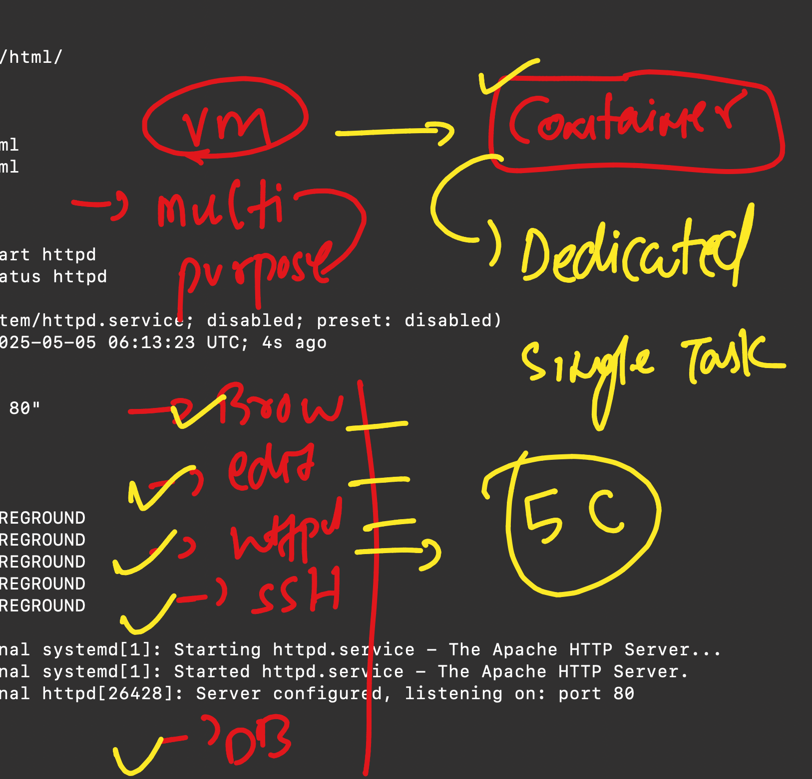

## setting up nginx in Ubuntu / RPM linux 

### setting up nginx in any RPM based system 
## Amazon linux -centos - redhat 

### step 1 -- switch to root user for full access and check below things 

```
[ec2-user@ip-172-31-24-37 ~]$ sudo -i
[root@ip-172-31-24-37 ~]# whoami 
root
[root@ip-172-31-24-37 ~]# uname -r
6.1.134-150.224.amzn2023.x86_64
[root@ip-172-31-24-37 ~]# uname 
Linux
[root@ip-172-31-24-37 ~]# cat  /etc/os-release 
NAME="Amazon Linux"
VERSION="2023"
ID="amzn"
ID_LIKE="fedora"
VERSION_ID="2023"
PLATFORM_ID="platform:al2023"
PRETTY_NAME="Amazon Linux 2023.7.20250428"
ANSI_COLOR="0;33"

```


### Installing httpd on amazon linux 

```
[root@ip-172-31-24-37 ~]# dnf install  httpd
Last metadata expiration check: 0:04:59 ago on Mon May  5 06:02:38 2025.
Dependencies resolved.
================================================================================================================================
 Package                           Architecture         Version                                 Repository                 Size
================================================================================================================================
Installing:
 httpd                             x86_64               2.4.62-1.amzn2023                       amazonlinux                48 k
Installing dependencies:

```

### checking setting / config file 

```
[root@ip-172-31-24-37 ~]# cd  /etc/httpd/
[root@ip-172-31-24-37 httpd]# ls
conf  conf.d  conf.modules.d  logs  modules  run  state
[root@ip-172-31-24-37 httpd]# cd conf
[root@ip-172-31-24-37 conf]# ls
httpd.conf  magic
[root@ip-172-31-24-37 conf]# 

```

### info about config default details 
- deafult port is 80 
- default location where developer can put webcode is /var/www/html/

### basic page 

```
[root@ip-172-31-24-37 conf]# cd  /var/www/html/
[root@ip-172-31-24-37 html]# ls
[root@ip-172-31-24-37 html]# 
[root@ip-172-31-24-37 html]# 
[root@ip-172-31-24-37 html]# vim index.html 
[root@ip-172-31-24-37 html]# cat index.html 
Hello world 
[root@ip-172-31-24-37 html]# 

```

### start httpd service 

```
[root@ip-172-31-24-37 html]# systemctl start httpd
[root@ip-172-31-24-37 html]# systemctl status httpd
● httpd.service - The Apache HTTP Server
     Loaded: loaded (/usr/lib/systemd/system/httpd.service; disabled; preset: disabled)
     Active: active (running) since Mon 2025-05-05 06:13:23 UTC; 4s ago
       Docs: man:httpd.service(8)
   Main PID: 26428 (httpd)
     Status: "Started, listening on: port 80"
      Tasks: 177 (limit: 1111)
```

# to setup any server we need to take care of 3 steps

- install the required software
- configure if requred 
- start service of server

## container vs vm 



### Demo of httpd dockerfile

```
FROM oraclelinux:8.4 
run dnf install httpd -y 
copy index.html /var/www/html/
cmd ["/usr/sbin/httpd", "-DFOREGROUND"]

```

## NGInx an opensource web server

- install nginx software 

```
dnf install nginx 
```
- checking config details

```
[root@ip-172-31-24-37 html]# cd /etc/nginx/
[root@ip-172-31-24-37 nginx]# ls
conf.d        fastcgi.conf.default    koi-utf     mime.types.default  scgi_params          uwsgi_params.default
default.d     fastcgi_params          koi-win     nginx.conf          scgi_params.default  win-utf
fastcgi.conf  fastcgi_params.default  mime.types  nginx.conf.default  uwsgi_params
[root@ip-172-31-24-37 nginx]# cat nginx.conf
# For more information on configuration, see:
#   * Official English Documentation: http://nginx.org/en/docs/
#   * Official Russian Documentation: http://nginx.org/ru/docs/

user nginx;
worker_processes auto;

```

## starting service 

```
[root@ip-172-31-24-37 html]# systemctl start nginx 
[root@ip-172-31-24-37 html]# systemctl status nginx 
● nginx.service - The nginx HTTP and reverse proxy server
     Loaded: loaded (/usr/lib/systemd/system/nginx.service; disabled; preset: disabled)
     Active: active (running) since Mon 2025-05-05 06:41:36 UTC; 4s ago
    Process: 31776 ExecStartPre=/usr/bin/rm -f /run/nginx.pid (code=exited, status=0/SUCCESS)
    Process: 31777 ExecStartPre=/usr/sbin/nginx -t (code=exited, status=0/SUCCESS)
    Process: 31788 ExecStart=/usr/sbin/nginx (code=exited, status=0/SUCCESS)
   Main PID: 31799 (nginx)
      Tasks: 2 (limit: 1111)
```

### overall httpd and nginx dockerfile with cmd statment understading 

```
[root@ip-172-31-24-37 html]# ls
404.html  50x.html  icons  index.html  nginx-logo.png  poweredby.png
[root@ip-172-31-24-37 html]# cd /var/www/html/
[root@ip-172-31-24-37 html]# ls
Dockerfile  index.html
[root@ip-172-31-24-37 html]# cp Dockerfile  nginx.dockerfile
[root@ip-172-31-24-37 html]# vim nginx.dockerfile 
[root@ip-172-31-24-37 html]# 
[root@ip-172-31-24-37 html]# cat Dockerfile 
FROM oraclelinux:8.4 
run dnf install httpd -y 
copy index.html /var/www/html/
cmd ["/usr/sbin/httpd", "-DFOREGROUND"]
# in systemctl start httpd is calling above command 
[root@ip-172-31-24-37 html]# cat  nginx.dockerfile 
FROM oraclelinux:8.4 
run dnf install nginx  -y 
copy index.html /usr/share/nginx/html/
cmd ["nginx", "-g","daemon off"]
# in systemctl start httpd is calling above command 
[root@ip-172-31-24-37 html]# 

```
